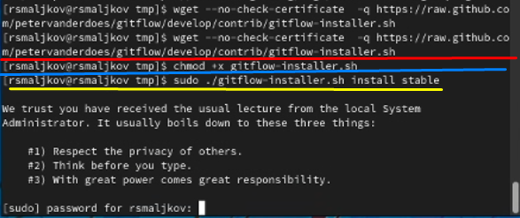
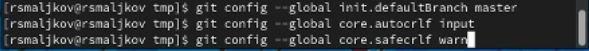
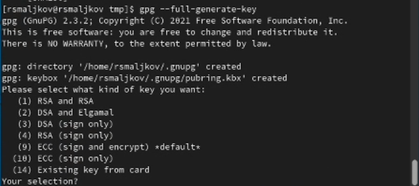
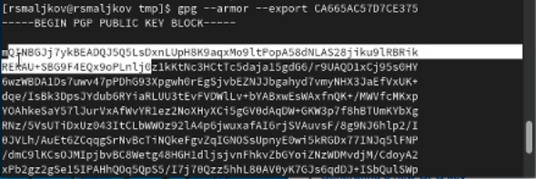
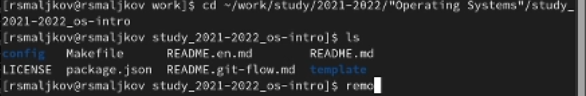

---
## Front matter
title: "Лабораторная работа №2 "
subtitle: "Управление версиями"
author: "Мальков Роман Сергеевич"

## Generic otions
lang: ru-RU
toc-title: "Содержание"


## Pdf output format
toc: true # Table of contents
toc-depth: 2
lof: true # List of figures
lot: true # List of tables
fontsize: 12pt
linestretch: 1.5
papersize: a4
documentclass: scrreprt
## I18n polyglossia
polyglossia-lang:
  name: russian
  options:
	- spelling=modern
	- babelshorthands=true
polyglossia-otherlangs:
  name: english
## I18n babel
babel-lang: russian
babel-otherlangs: english
## Fonts
mainfont: PT Serif
romanfont: PT Serif
sansfont: PT Sans
monofont: PT Mono
mainfontoptions: Ligatures=TeX
romanfontoptions: Ligatures=TeX
sansfontoptions: Ligatures=TeX,Scale=MatchLowercase
monofontoptions: Scale=MatchLowercase,Scale=0.9
## Biblatex
biblatex: true
biblio-style: "gost-numeric"
biblatexoptions:
  - parentracker=true
  - backend=biber
  - hyperref=auto
  - language=auto
  - autolang=other*
  - citestyle=gost-numeric
## Pandoc-crossref LaTeX customization
figureTitle: "Рис."
tableTitle: "Таблица"
listingTitle: "Листинг"
lofTitle: "Список иллюстраций"
lotTitle: "Список таблиц"
lolTitle: "Листинги"
## Misc options
indent: true
header-includes:
  - \usepackage{indentfirst}
  - \usepackage{float} # keep figures where there are in the text
  - \floatplacement{figure}{H} # keep figures where there are in the text
---
## РОССИЙСКИЙ УНИВЕРСИТЕТ ДРУЖБЫ НАРОДОВ


Факультет физико-математических и естественных наук
Кафедра фундаментальной информатики и информационных
технологий


ОТЧЁТ
ПО ЛАБОРАТОРНОЙ РАБОТЕ No1
дисциплина: Операционные системы

 
 
 
 
 
Студент: Мальков Роман Сергеевич

Группа: НФИбд-02-21
 
 
 
 
 
 
 
 
 
 
МОСКВА
2022 г.

# Цель работы

* Изучить идеологию и применение средств контроля версий.
* Освоить умения по работе с git.


# Задание

* Создать базовую конфигурацию для работы с git.
* Создать ключ SSH.
* Создать ключ PGP.
* Настроить подписи git.
* Зарегистрироваться на Github.
* Создать локальный каталог для выполнения заданий по предмету.


# Выполнение лабораторной работы

Создаем учётную запись на https://github.com и заполняем нужные данные(Скриншот 1).


( Скриншот 1 )

Устанавливаем git-flow и gh на Fedora Linux(Скриншот 2-3), используя следующие команды.

```
cd /tmp
2 wget --no-check-certificate -q https://raw.github.com/petervanderdoes ⌋
↪ /gitflow/develop/contrib/gitflow-installer.sh
3 chmod +x gitflow-installer.sh
4 sudo ./gitflow-installer.sh install stable
sudo dnf install gh
```


(Скриншот 2)


(Скриншот 3)

Производим базовую настроуку git, задаем имя и електронную почту владельца репозитория(Скриншот 4):
```
git config --global user.name "Name Surname"
2 git config --global user.email "work@mail"
```
Настраиваем utf-8 в выводе сообщений git(Скриншот 4):

```
git config --global core.quotepath false
```

(Скриншот 4)
Настраиваем верефикацию и подписание git, задаем имя начальной ветки, задаем параметр autocrlf и  safecrlf(Скриншот 5):
```
git config --global init.defaultBranch master
git config --global core.autocrlf input
git config --global core.safecrlf warn
```


(Скриншот 5)

Создаем ключи ssh по алгоритму rsa размером 4096, и по алгоритму ed25519(Скриншот 6-7):

```
ssh-keygen -t rsa -b 4096
ssh-keygen -t ed25519
```

(Скриншот 6)

(Скриншот 7)

Создаем ключ pgp(Скриншот 8):
```
gpg --full-generate-key
```
* Из предложенных опций выбираем:
* тип RSA and RSA;
* размер 4096;
* выберите срок действия; значение по умолчанию— 0 (срок действия не истекает
никогда).
* GPG запросит личную информацию, которая сохранится в ключе:
* Имя (не менее 5 символов).
* Адрес электронной почты.
* При вводе email убедитесь, что он соответствует адресу, используемому на
GitHub.
* Комментарий. Можно ввести что угодно или нажать клавишу ввода, чтобы
оставить это поле пустым.


(Скриншот 8)

Далее копируем отпечаток привтаного ключа, он выводился на экран консоли, при генерации(Скриншот 9).


(Скриншот 9)

После этого, используем команду указанную ниже, чтобу получить ключ, и ввести его на https://github.com/settings/keys (Скриншот 10):


(Скриншот 10)
```
gpg --armor --export <Ваш отпечаток приватного ключа>
```
Настраиваем автоматические подписи git(Скриншот 11):

```
git config --global user.signingkey <PGP Fingerprint>
2 git config --global commit.gpgsign true
3 git config --global gpg.program $(which gpg2)
```


(Скриншот 11)

Настройка gh(Скриншот 12):
```
gh auth login
```

(Скриншот 12)

Создаем репозиторий курса на основе шаблона(Скриншот 13-15):
```
mkdir -p ~/work/study/2021-2022/"Операционные системы"
2 cd ~/work/study/2021-2022/"Операционные системы"
3 gh repo create study_2021-2022_os-intro
↪ --template=yamadharma/course-directory-student-template --public
4 git clone --recursive
↪ https://github.com/MstislavRomanovski/study_2021-2022_os-intro.git
```


(Скриншот 13)

(Скриншот 14)

(Скриншот 15)

Настраиваем каталог курса, а имеено, переходим в каталог курса, удаляем лишние файлы(у меня не удалились), созадем необходимые каталоги(пришлось получить рут права для этого), и отправляем файлы на сервер(Скриншоты 16-20):
```
cd ~/work/study/2021-2022/"Operating Systems"/study_2021-2022_os-intro
rm package.json
make COURSE=os-intro
git add .
git commit -am 'feat(main): make course structure'
git push
```



(Скриншоты 16 - 20)

# Выводы

Мы изучили идеалогию по контролю версий, и научились работать с git.

