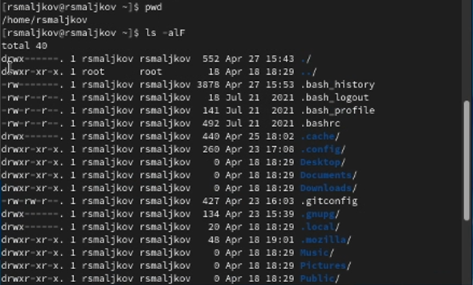
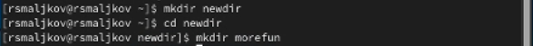
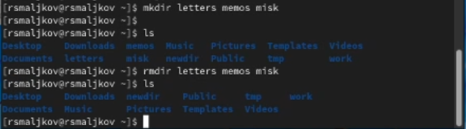
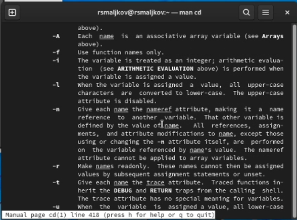
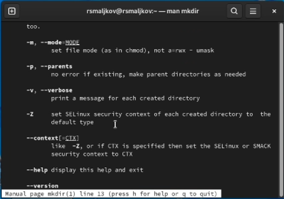
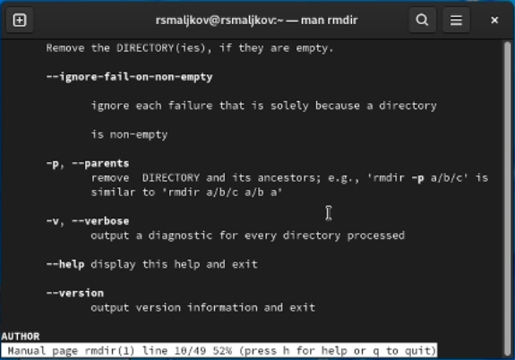
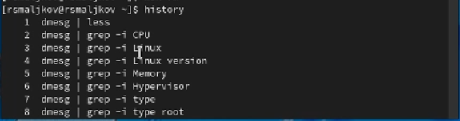
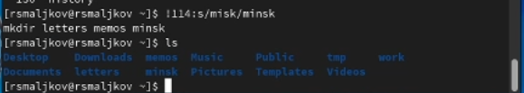
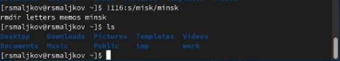

---
## Front matter
title: "Лабораторная работа №4"
subtitle: " Основы интерфейса взаимодействия пользователя с системой Unix на уровне командной строки"
author: "Мальков Роман Сергеевич"

## Generic otions
lang: ru-RU
toc-title: "Содержание"

## Bibliography
bibliography: bib/cite.bib
csl: pandoc/csl/gost-r-7-0-5-2008-numeric.csl

## Pdf output format
toc: true # Table of contents
toc-depth: 2
fontsize: 12pt
linestretch: 1.5
papersize: a4
documentclass: scrreprt
## I18n polyglossia
polyglossia-lang:
  name: russian
  options:
	- spelling=modern
	- babelshorthands=true
polyglossia-otherlangs:
  name: english
## I18n babel
babel-lang: russian
babel-otherlangs: english
## Fonts
mainfont: PT Serif
romanfont: PT Serif
sansfont: PT Sans
monofont: PT Mono
mainfontoptions: Ligatures=TeX
romanfontoptions: Ligatures=TeX
sansfontoptions: Ligatures=TeX,Scale=MatchLowercase
monofontoptions: Scale=MatchLowercase,Scale=0.9
## Biblatex
biblatex: true
biblio-style: "gost-numeric"
biblatexoptions:
  - parentracker=true
  - backend=biber
  - hyperref=auto
  - language=auto
  - autolang=other*
  - citestyle=gost-numeric

## Misc options
indent: true
header-includes:
  - \usepackage{indentfirst}
  - \usepackage{float} # keep figures where there are in the text
  - \floatplacement{figure}{H} # keep figures where there are in the text
---

# Цель работы

Приобретение практических навыков взаимодействия пользователя с системой посредством командной строки.

# Задание

1. Определить полное имя вашего домашнего каталога. Далее относительно этого каталога будут выполняться последующие действия.
2. Выполнить следующие действия:
2.1. Перейти в каталог /tmp.
2.2. Вывести на экран содержимое каталога /tmp. Для этого использовать команду ls с различными опциями. Пояснить разницу в выводимой на экран информации.
2.3. Определить, есть ли в каталоге /var/spool подкаталог с именем cron?
2.4. Перейти в Ваш домашний каталог и вывести на экран его содержимое. Определить, кто является владельцем файлов и подкаталогов?
3. Выполнить следующие действия:
* В домашнем каталоге создайть новый каталог с именем newdir.
* В каталоге ~/newdir создайть новый каталог с именем morefun.
* В домашнем каталоге создайть одной командой три новых каталога с именами
letters, memos, misk. Затем удалить эти каталоги одной командой.
* Попробовать удалить ранее созданный каталог ~/newdir командой rm. Проверьть, был ли каталог удалён.
* Удалить каталог ~/newdir/morefun из домашнего каталога. Проверить, был ли
каталог удалён.
4. С помощью команды man определить, какую опцию команды ls нужно использовать для просмотра содержимого не только указанного каталога, но и подкаталогов,
входящих в него.
5. С помощью команды man определить набор опций команды ls, позволяющий отсортировать по времени последнего изменения выводимый список содержимого каталога с развёрнутым описанием файлов.
6. Использовать команду man для просмотра описания следующих команд: cd, pwd, mkdir, rmdir, rm. Пояснить основные опции этих команд.
7. Использовать информацию, полученную при помощи команды history, выполнить модификацию и исполнение нескольких команд из буфера команд.


# Выполнение лабораторной работы

Определяем полное имя домашнего каталога командой pwd. Далее переходим в каталог /tmp, выводим содержимое этого католога командой ```ls``` с разными параметрами, а именно:
* -a отвечает за вывод скрытых файлов 
* -F выводит тип файла посредством добавления к концу названия файла одного из символов(/,*,@)  
* -l выводит всю информацию о файле, дату, автора, разрешения и т.д 
* -alF, что логично, выводит все скрытые файлы, со всей информацией о них, вместе с указанием соответсвтующего типа (см.Скриншот 1).


(Скриншот 1)

Определяем, есть ли в каталоге /var/spool подкаталог с именем cron. Для этого переходим в каталог var/spoon командой ```cd var/spoon```, и затем используем команду ```ls```(см.Скриншот 2).


(Скриншот 2)

Переходим в домашний каталог командой ```cd```, затем выводим все его содержимое командой ```ls -alF```, тем самым мы также узнаем и владельцев файлов (см.Скриншот 3).

(Скриншот 3)

Создаем каталог newdir и подкаталог morefun, используя команды ```mkdir newdir```, ```cd newdir```, ```mkdir morefun``` (см.Скриншот 4)

(Скриншот 4)
Далее создаем одной командой ```mkdir letters memos misk``` три каталога - letters, memos, misk. После все эти три каталога удаляем командой ```rmdir letters memos misk``` (см.Скриншот 5).


(Скриншот 5)

Удаляем каталог newdir вместе с подкаталогом morefun следующей командой ```rm -r newdir``` (см.Скриншот 6)

(Скриншот 6)

Командой ```man ls``` узнаем набор опций команды ls для просмотра содержимого каталогов. Выяснив нужную опцию, понимаем что команда принимает следующий вид ``` ls -R ```(см.Скриншоты 7-8)

(Скриншот 7)

(Скриншот 8)
 
После, опять же используем команду ```man ls``` для того чтобы узнать опции для сортировки по времени и выдачи полной информации о файлах. Получим следующую команду ```ls -tl```(см.Скриншот 9).

(Скриншот 9)

Далее получем ифнормацию об опциях команд ```cd```, ```pwd```, ```mkdir```, ```rmdir```, ```rm```, командой ```man```(см.Скриншоты 10 - 14).

(Скриншот 10)

(Скриншот 11)

(Скриншот 12)

(Скриншот 13)

(Скриншот 14)

Узнаем историю выполненых команд командой ```history```, и вызываем команды с внесением изменений, используя следующие команды: ```!114:s/misk/minsk``` для создания трех каталогов одной командой, и ```!116:s/misk/minsk``` для удаления этих трех каталогов. Разберем команду, 114 и 116 это номера использованных команд в буфере команд. ```:s/misk/minsk``` отвечает за замену одной из частей команды на другую, в данном случае меняем misk на minsk(см.Скриншоты 15 - 17).


(Скриншот 15)

(Скриншот 16)

(Скриншот 17)
# Вывод
Мы преобрели навыки взаимодействия с системой посредством использования командной строки. 


