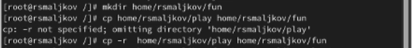
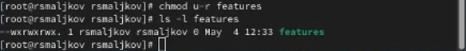
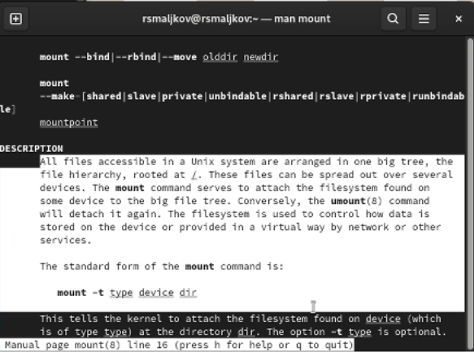
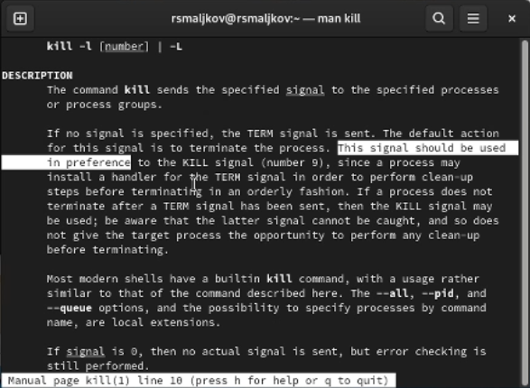

---
## Front matter
lang: ru-RU
title: Лабораторная работа №5
author: |
	Malkov Roman Sergeevich
date: 30.04.2022

## Formatting
toc: false
slide_level: 2
theme: metropolis
header-includes: 
 - \metroset{progressbar=frametitle,sectionpage=progressbar,numbering=fraction}
 - '\makeatletter'
 - '\beamer@ignorenonframefalse'
 - '\makeatother'
aspectratio: 43
section-titles: true
---


## Цель работы

Ознакомление с файловой системой Linux, её структурой, именами и содержанием
каталогов. Приобретение практических навыков по применению команд для работы
с файлами и каталогами, по управлению процессами (и работами), по проверке использования диска и обслуживанию файловой системы.

## Ход работы

Выполняем копирование файла в текущем каталоге. Для этого используем следующие команды: 

```
touch abc1
cp abc1 april
cp abc1 may

```
Далее выполянем копирование нескольких файлов(may и april) в каталог(monthly) одной командой(тут я немного ошибся и скопировал их двумя отдельными командами, следует быть внимательнее):

```
mkdir monthly
cp april may monthly

```

## Ход работы
Копирование файлов в произвольном каталоге:

```
cp monthly/may monthly/june

```
Копирование каталога в текущем каталоге:

```
mkdir monthly.00
cp -r monthly monthly.00

```

## 1
Копирование каталогов в произвольном каталоге:

```
cp -r monthly.00 /tmp

```

Переименование файлов в текущем каталоге. Изменить название файла april на
july в домашнем каталоге:
```
mv april july

```

## 1
Перемещение файлов в другой каталог. Переместить файл july в каталог monthly.00:
```
mv july monthly.00
ls monthly.00

```
Переименование каталогов в текущем каталоге. Переименовать каталог monthly.00
в monthly.01:
```
mv monthly.00 monthly.01

```

## 1
Перемещение каталога в другой каталог. Переместить каталог monthly.01в каталог
reports:
```
mkdir reports
mv monthly.01 reports

```
Переименование каталога, не являющегося текущим. Переименовать каталог
reports/monthly.01 в reports/monthly:

```
mv reports/monthly.01 reports/monthly

```

## 1
Меняем права владельца файла ~/may, дав тем самым ему права на выполнение:

```
chmod u+x may

```
Лишаем владельца прав на выполнение:

```
chmod u-x may

```

## 1
Меняем права доступа monthly, запретив чтение для всех членов группы и всех остальных пользователей:

```
chmod g-r, o-r monthly

```
Меняем права доступа к файлу ~/abc1, предоставив право записи членам группы:
```
chmod g+w abc1

```

## 2
Копируем файл /usr/include/sys/io.h в домашний каталог и называем его
equipment:
```
cp /usr/include/sys/io.h /home/rsmaljkov
mv io.h equipment

```
В домашнем каталоге создаем директорию ~/ski.plases:
```
mkdir ski.places

```

## 2
Перещаем файл equipment в каталог ~/ski.plases и переименовывыем в equiplist:
```
mv equipment ~/ski.places/equiplist

```
Создаем в домашнем каталоге файл abc1 и копируем его в каталог
~/ski.plases, называем его equiplist2:
```
cp abc1 ~/ski.places
mv ~/ski.places/equiplist2

```

## 2
Создаем каталог с именем equipment в каталоге ~/ski.plases:
```
mkdir ski.places/equipment

```

Перемещаем файлы ~/ski.plases/equiplist и equiplist2 в каталог
~/ski.plases/equipment:
```
mv ~/ski.places/equiplist ~/ski.places/equipment/equiplist
mv ~/ski.places/equiplist2 ~/ski.places/equipment/equiplist2

```

## 2
Создаем и переместите каталог ~/newdir в каталог ~/ski.plases и назовите
его plans:
```
mkdir newdir
mv newdir ski.places/plans

```

## 3
Определяем опции команды chmod, необходимые для того, чтобы присвоить
выделенные права доступа, предварительно создав эти файлы(Скриншоты 4 - 8):
```
mkdir australia
mkdir play
touch my_os
touch features

chmod 744 australia
chmod 711 play
chmod 544 my_os
chmod 654 features
```

## 4
Просматриваем содержимое файла /etc/password, затем копируем файл ~/features в файл ~/file.old

Пермещаем ~/file.old в каталог ~/play

После этого, копируем каталог ~/play в каталог ~/fun, перемещаем каталог ~/fun в каталог ~/play и называем его games


## 4

Далее мы лишаем владельца файла ~/features права на чтение, пытыемся открыть и скопировать файл, и смотрим на результат, после этого возвращаем право на чтение.




## 4


Затем лишаем владельца права на выполнение каталога ~/play, переходим в каталог, смотрим результат, а после возвращаем право на выполнение


## 4


## 5


## 5


## 5


## 5



## Вывод
Мы ознакомились с файловой системой Linux, её структурой, именами и содержанием
каталогов. Приобрели практических навыков по применению команд для работы
с файлами и каталогами, по управлению процессами (и работами), по проверке использования диска и обслуживанию файловой системы.
