---
## Front matter
title: "Лабораторная работа №5"
subtitle: "Анализ файловой системы Linux. Команды для работы с файлами и каталогами"
author: "Мальков Роман"

## Generic otions
lang: ru-RU
toc-title: "Содержание"

## Bibliography
bibliography: bib/cite.bib
csl: pandoc/csl/gost-r-7-0-5-2008-numeric.csl

## Pdf output format
toc: true # Table of contents
toc-depth: 2

fontsize: 12pt
linestretch: 1.5
papersize: a4
documentclass: scrreprt
## I18n polyglossia
polyglossia-lang:
  name: russian
  options:
	- spelling=modern
	- babelshorthands=true
polyglossia-otherlangs:
  name: english
## I18n babel
babel-lang: russian
babel-otherlangs: english
## Fonts
mainfont: PT Serif
romanfont: PT Serif
sansfont: PT Sans
monofont: PT Mono
mainfontoptions: Ligatures=TeX
romanfontoptions: Ligatures=TeX
sansfontoptions: Ligatures=TeX,Scale=MatchLowercase
monofontoptions: Scale=MatchLowercase,Scale=0.9
## Biblatex
biblatex: true
biblio-style: "gost-numeric"
biblatexoptions:
  - parentracker=true
  - backend=biber
  - hyperref=auto
  - language=auto
  - autolang=other*
  - citestyle=gost-numeric
## Pandoc-crossref LaTeX customization
figureTitle: "Рис."
tableTitle: "Таблица"
listingTitle: "Листинг"
lofTitle: "Список иллюстраций"
lotTitle: "Список таблиц"
lolTitle: "Листинги"
## Misc options
indent: true
header-includes:
  - \usepackage{indentfirst}
  - \usepackage{float} # keep figures where there are in the text
  - \floatplacement{figure}{H} # keep figures where there are in the text
---
# Цель работы

Ознакомление с файловой системой Linux, её структурой, именами и содержанием
каталогов. Приобретение практических навыков по применению команд для работы
с файлами и каталогами, по управлению процессами (и работами), по проверке использования диска и обслуживанию файловой системы.

# Задание
1. Выполните все примеры, приведённые в первой части описания лабораторной работы.
2. Выполните следующие действия, зафиксировав в отчёте по лабораторной работе
используемые при этом команды и результаты их выполнения:
- 2.1. Скопируйте файл /usr/include/sys/io.h в домашний каталог и назовите его
equipment. Если файла io.h нет, то используйте любой другой файл в каталоге
/usr/include/sys/ вместо него.
- 2.2. В домашнем каталоге создайте директорию ~/ski.plases.
- 2.3. Переместите файл equipment в каталог ~/ski.plases.
- 2.4. Переименуйте файл ~/ski.plases/equipment в ~/ski.plases/equiplist.
- 2.5. Создайте в домашнем каталоге файл abc1 и скопируйте его в каталог
~/ski.plases, назовите его equiplist2.
- 2.6. Создайте каталог с именем equipment в каталоге ~/ski.plases.
- 2.7. Переместите файлы ~/ski.plases/equiplist и equiplist2 в каталог
~/ski.plases/equipment.
- 2.8. Создайте и переместите каталог ~/newdir в каталог ~/ski.plases и назовите его plans.
3. Определите опции команды chmod, необходимые для того, чтобы присвоить перечисленным ниже файлам выделенные права доступа, считая, что в начале таких прав
нет:
- 3.1. drwxr--r-- ... australia
- 3.2. drwx--x--x ... play
- 3.3. -r-xr--r-- ... my_os
- 3.4. -rw-rw-r-- ... feathers
При необходимости создайте нужные файлы.
4. Проделайте приведённые ниже упражнения, записывая в отчёт по лабораторной
работе используемые при этом команды:
- 4.1. Просмотрите содержимое файла /etc/password.
- 4.2. Скопируйте файл ~/feathers в файл ~/file.old.
- 4.3. Переместите файл ~/file.old в каталог ~/play.
- 4.4. Скопируйте каталог ~/play в каталог ~/fun.
- 4.5. Переместите каталог ~/fun в каталог ~/play и назовите его games.
- 4.6. Лишите владельца файла ~/feathers права на чтение.
- 4.7. Что произойдёт, если вы попытаетесь просмотреть файл ~/feathers командой cat?
- 4.8. Что произойдёт, если вы попытаетесь скопировать файл ~/feathers?
- 4.9. Дайте владельцу файла ~/feathers право на чтение.
- 4.10. Лишите владельца каталога ~/play права на выполнение.
- 4.11. Перейдите в каталог ~/play. Что произошло?
- 4.12. Дайте владельцу каталога ~/play право на выполнение.
5. Прочитайте man по командам mount, fsck, mkfs, kill и кратко их охарактеризуйте, приведя примеры.6. 

# Теоретическое введение


Каждый файл или каталог имеет права доступа.
В сведениях о файле или каталоге указываются:

- тип файла (символ (-) обозначает файл, а символ (d) — каталог);
- права для владельца файла (r — разрешено чтение, w — разрешена запись, x — разрешено выполнение, - — право доступа отсутствует);
- права для членов группы (r — разрешено чтение, w — разрешена запись, x — разрешено
выполнение, - — право доступа отсутствует);
- права для всех остальных (r — разрешено чтение, w — разрешена запись, x — разрешено
выполнение, - — право доступа отсутствует).

-----------------------------------------------------------------------------
 
 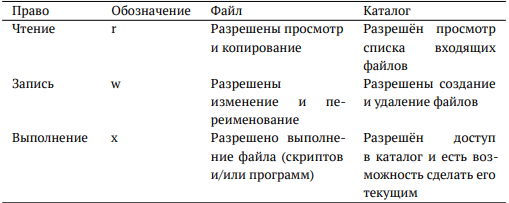
 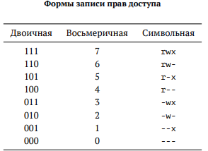
 
 ``` chmod u+r modb ``` к примеру данная команда меняет права доступа владельца, добавляя ему возможность чтения файла.
  ``` chmod 300 modb ``` а данный пример команды уже разрешает владельцу запись и выполнение файла без возможности его чтения, в тоже время забирая возможность других пользователей читать, записывать, и выполнять файл.


# Ход работы

## 1
Выполняем копирование файла в текущем каталоге. Для этого используем следующие команды: 

```
touch abc1
cp abc1 april
cp abc1 may

```
Далее выполянем копирование нескольких файлов(may и april) в каталог(monthly) одной командой(тут я немного ошибся и скопировал их двумя отдельными командами, следует быть внимательнее):

```
mkdir monthly
cp april may monthly

```

Копирование файлов в произвольном каталоге:

```
cp monthly/may monthly/june

```
Копирование каталога в текущем каталоге:

```
mkdir monthly.00
cp -r monthly monthly.00

```
Копирование каталогов в произвольном каталоге:

```
cp -r monthly.00 /tmp

```
Переименование файлов в текущем каталоге. Изменить название файла april на
july в домашнем каталоге:
```
mv april july

```
Перемещение файлов в другой каталог. Переместить файл july в каталог monthly.00:
```
mv july monthly.00
ls monthly.00

```
Переименование каталогов в текущем каталоге. Переименовать каталог monthly.00
в monthly.01:
```
mv monthly.00 monthly.01

```
Перемещение каталога в другой каталог. Переместить каталог monthly.01в каталог
reports:
```
mkdir reports
mv monthly.01 reports

```
Переименование каталога, не являющегося текущим. Переименовать каталог
reports/monthly.01 в reports/monthly:

```
mv reports/monthly.01 reports/monthly

```
Меняем права владельца файла ~/may, дав тем самым ему права на выполнение:

```
chmod u+x may

```
Лишаем владельца прав на выполнение:

```
chmod u-x may

```
Меняем права доступа monthly, запретив чтение для всех членов группы и всех остальных пользователей:

```
chmod g-r, o-r monthly

```
Меняем права доступа к файлу ~/abc1, предоставив право записи членам группы:
```
chmod g+w abc1

```
Скриншоты 1-2 к вышеописанным действиям прилагаются ниже:

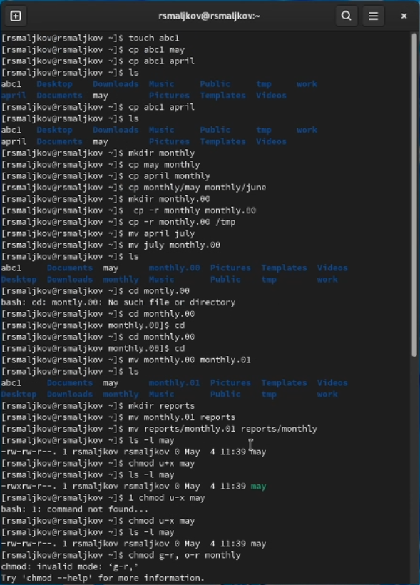
(Скриншот 1)


(Скриншот 2)

## 2

Копируем файл /usr/include/sys/io.h в домашний каталог и называем его
equipment:
```
cp /usr/include/sys/io.h /home/rsmaljkov
mv io.h equipment

```
В домашнем каталоге создаем директорию ~/ski.plases:
```
mkdir ski.places

```
Перещаем файл equipment в каталог ~/ski.plases и переименовывыем в equiplist:
```
mv equipment ~/ski.places/equiplist

```
Создаем в домашнем каталоге файл abc1 и копируем его в каталог
~/ski.plases, называем его equiplist2:
```
cp abc1 ~/ski.places
mv ~/ski.places/equiplist2

```
Создаем каталог с именем equipment в каталоге ~/ski.plases:
```
mkdir ski.places/equipment

```
Перемещаем файлы ~/ski.plases/equiplist и equiplist2 в каталог
~/ski.plases/equipment:
```
mv ~/ski.places/equiplist ~/ski.places/equipment/equiplist
mv ~/ski.places/equiplist2 ~/ski.places/equipment/equiplist2

```
Создаем и переместите каталог ~/newdir в каталог ~/ski.plases и назовите
его plans:
```
mkdir newdir
mv newdir ski.places/plans

```
Скриншот 3 ,описывающий все вышеперечисленные действия пункта 2, прикреплен ниже.
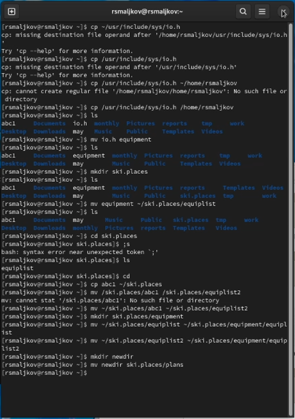
(Скриншот 3)

## 3
Определяем опции команды chmod, необходимые для того, чтобы присвоить
выделенные права доступа, предварительно создав эти файлы(Скриншоты 4 - 8):
```
mkdir australia
mkdir play
touch my_os
touch features

chmod 744 australia
chmod 711 play
chmod 544 my_os
chmod 654 features
```


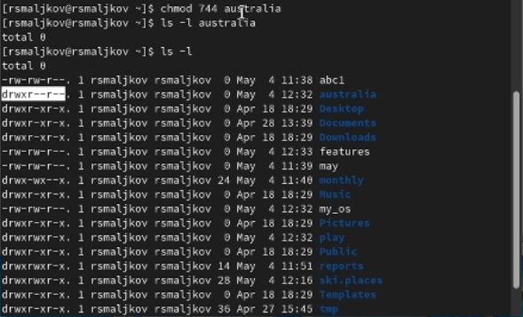

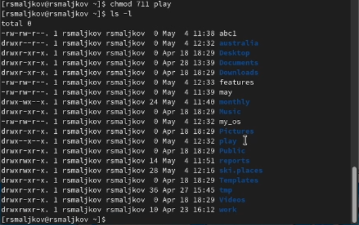

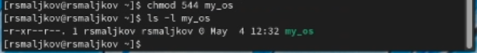


(Скриншоты 4 - 8)

## 4
Просматриваем содержимое файла /etc/password, затем копируем файл ~/features в файл ~/file.old, пермещаем ~/file.old в каталог ~/play. После этого, копируем каталог ~/play в каталог ~/fun, перемещаем каталог ~/fun в каталог ~/play и называем его games. Далее мы лишаем владельца файла ~/features права на чтение, пытыемся открыть и скопировать файл, и смотрим на результат, после этого возвращаем право на чтение. Затем лишаем владельца права на выполнение каталога ~/play, переходим в каталог, смотрим результат, а после возвращаем право на выполнение(9-19).


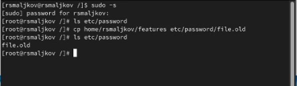


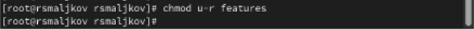


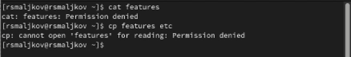

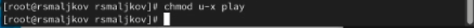

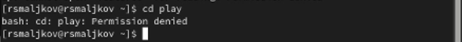

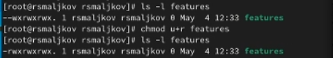


(Скриншоты 9-19)

## 5
При помощи команды man узнаем общую характеристику команд mount, fsck, mkfs, kill(Скриншоты 20 - 24).


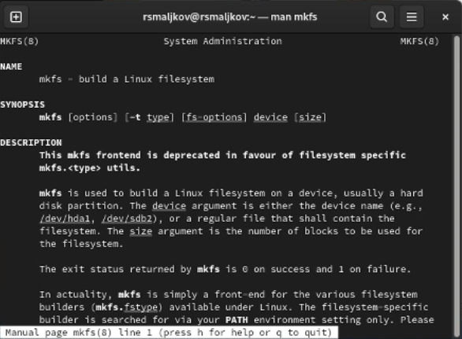


(Скриншоты 20-24)

# Выводы
Мы ознакомились с файловой системой Linux, её структурой, именами и содержанием
каталогов. Приобрели практических навыков по применению команд для работы
с файлами и каталогами, по управлению процессами (и работами), по проверке использования диска и обслуживанию файловой системы.


