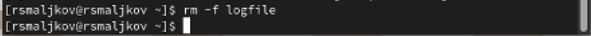
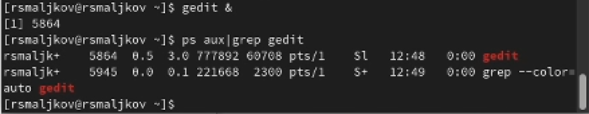
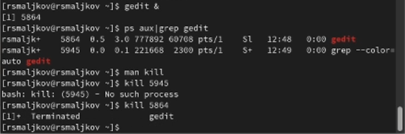
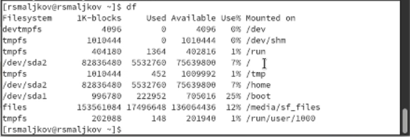
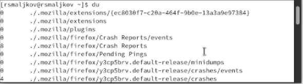
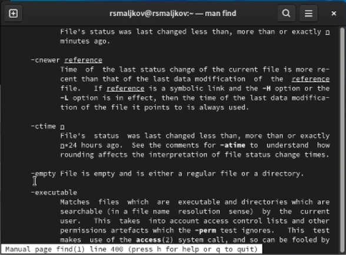

---
## Front matter
lang: ru-RU
title: Лабораторная работа №6
author: |
	Malkov Roman Sergeevich
date: 05.05.2022

## Formatting
toc: false
slide_level: 2
theme: metropolis
header-includes: 
 - \metroset{progressbar=frametitle,sectionpage=progressbar,numbering=fraction}
 - '\makeatletter'
 - '\beamer@ignorenonframefalse'
 - '\makeatother'
aspectratio: 44
section-titles: true
---

## Цель работы

Ознакомление с инструментами поиска файлов и фильтрации текстовых данных.
Приобретение практических навыков: по управлению процессами (и заданиями), по
проверке использования диска и обслуживанию файловых систем.

## Ход работы

Осуществляем вход в систему, используя соответсвующее имя и пароль.

## Ход работы

Записываем в файл file.txt названия файлов, содержащихся в каталоге /etc. Дописываем в этот же файл названия файлов, содержащихся в вашем домашнем каталоге.

## Ход работы

Выводим имена всех файлов из file.txt, имеющих расширение .conf, после чего
записывем их в новый текстовой файл conf.txt.

## Ход работы

Определяем, какие файлы в нашем домашнем каталоге имеют имена, начинающиеся
с символа c. Выполняем несколькими способами.

## Ход работы

## Ход работы

Выводим на экран имена файлов из каталога /etc, начинающиеся
с символа h.

## Ход работы

Запускаем в фоновом режиме процесс, который будет записывать в файл ~/logfile
файлы, имена которых начинаются с log.

## Ход работы

Удаляем файл ~/logfile(Скриншот 8).

## Ход работы

Запускаем из консоли в фоновом режиме редактор gedit.Определяем идентификатор процесса gedit, используя команду ps, конвейер и фильтр grep.

## Ход работы

Читаем справку (man) команды kill, после чего используем её для завершения
процесса gedit.

## Ход работы

## Ход работы

Выполяем команды df и du, предварительно получив более подробную информацию
об этих командах, с помощью команды man.

## Ход работы

## Ход работы

## Ход работы

## Ход работы

Воспользовавшись справкой команды find, выводим имена всех директорий, имеющихся в вашем домашнем каталоге.

## Ход работы

## Вывод
Мы ознакомились с инструментами поиска файлов и фильтрации текстовых данных.
Приобрели практические навыки: по управлению процессами (и заданиями), по
проверке использования диска и обслуживанию файловых систем.