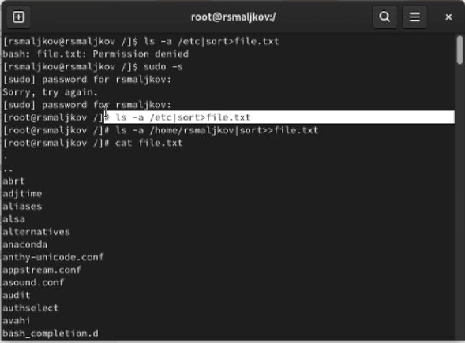
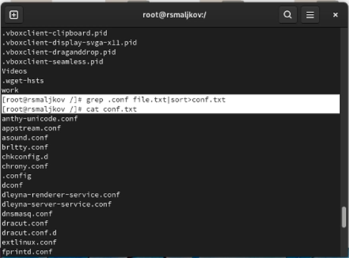
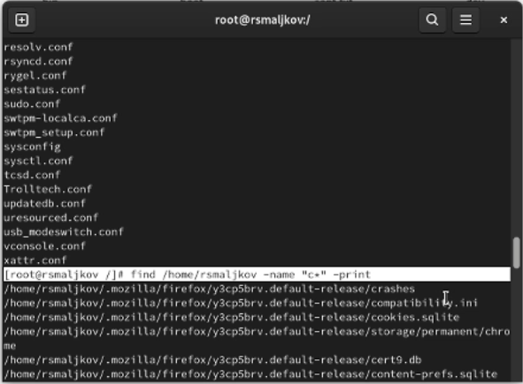
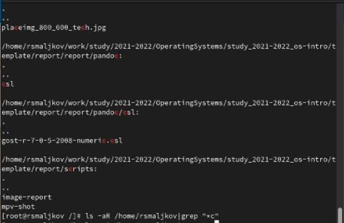
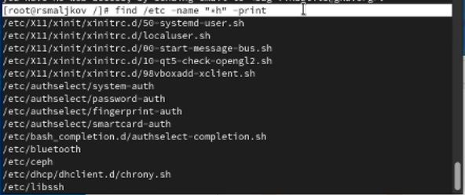
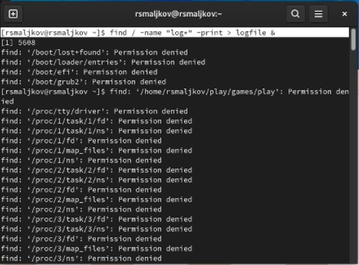
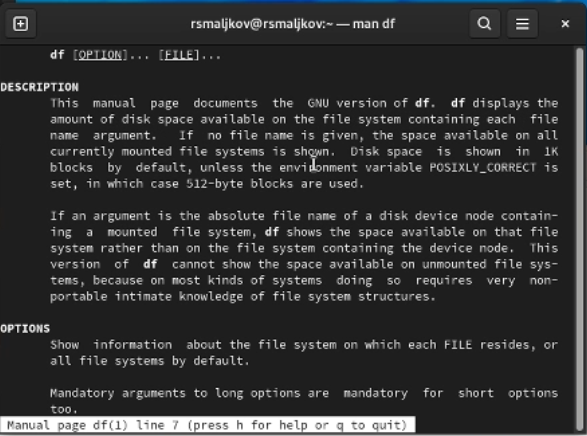
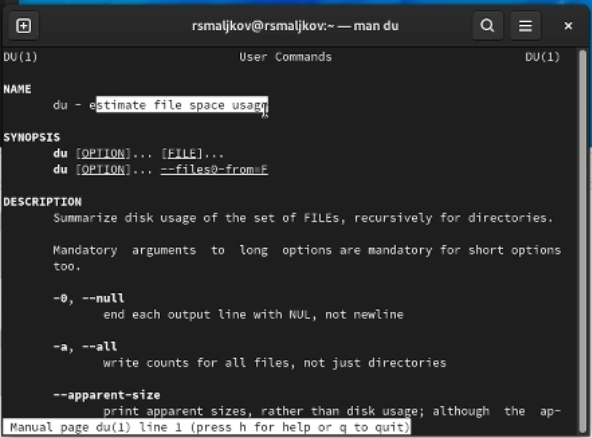
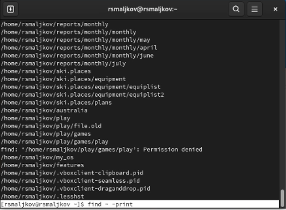

---
## Front matter
title: "Лабораторная работа №6"
subtitle: "Поиск файлов. Перенаправление ввода-вывода. Просмотр запущенных процессов"
author: "Мальков Роман"

## Generic otions
lang: ru-RU
toc-title: "Содержание"

## Bibliography
bibliography: bib/cite.bib
csl: pandoc/csl/gost-r-7-0-5-2008-numeric.csl

## Pdf output format
toc: true # Table of contents
toc-depth: 2

fontsize: 12pt
linestretch: 1.5
papersize: a4
documentclass: scrreprt
## I18n polyglossia
polyglossia-lang:
  name: russian
  options:
	- spelling=modern
	- babelshorthands=true
polyglossia-otherlangs:
  name: english
## I18n babel
babel-lang: russian
babel-otherlangs: english
## Fonts
mainfont: PT Serif
romanfont: PT Serif
sansfont: PT Sans
monofont: PT Mono
mainfontoptions: Ligatures=TeX
romanfontoptions: Ligatures=TeX
sansfontoptions: Ligatures=TeX,Scale=MatchLowercase
monofontoptions: Scale=MatchLowercase,Scale=0.9
## Biblatex
biblatex: true
biblio-style: "gost-numeric"
biblatexoptions:
  - parentracker=true
  - backend=biber
  - hyperref=auto
  - language=auto
  - autolang=other*
  - citestyle=gost-numeric
## Pandoc-crossref LaTeX customization
figureTitle: "Рис."
tableTitle: "Таблица"
listingTitle: "Листинг"
lofTitle: "Список иллюстраций"
lotTitle: "Список таблиц"
lolTitle: "Листинги"
## Misc options
indent: true
header-includes:
  - \usepackage{indentfirst}
  - \usepackage{float} # keep figures where there are in the text
  - \floatplacement{figure}{H} # keep figures where there are in the text
---
# Цель работы

Ознакомление с инструментами поиска файлов и фильтрации текстовых данных.
Приобретение практических навыков: по управлению процессами (и заданиями), по
проверке использования диска и обслуживанию файловых систем.


# Задание
1. Осуществите вход в систему, используя соответствующее имя пользователя.
2. Запишите в файл file.txt названия файлов, содержащихся в каталоге /etc. Допишите в этот же файл названия файлов, содержащихся в вашем домашнем каталоге.
3. Выведите имена всех файлов из file.txt, имеющих расширение .conf, после чего
запишите их в новый текстовой файл conf.txt.4. 
4. Определите, какие файлы в вашем домашнем каталоге имеют имена, начинавшиеся
с символа c? Предложите несколько вариантов, как это сделать.
5. Выведите на экран (по странично) имена файлов из каталога /etc, начинающиеся
с символа h.
6. Запустите в фоновом режиме процесс, который будет записывать в файл ~/logfile
файлы, имена которых начинаются с log.
7. Удалите файл ~/logfile.
8. Запустите из консоли в фоновом режиме редактор gedit.
9. Определите идентификатор процесса gedit, используя команду ps, конвейер и фильтр
grep. Как ещё можно определить идентификатор процесса?
10. Прочтите справку (man) команды kill, после чего используйте её для завершения
процесса gedit.
11. Выполните команды df и du, предварительно получив более подробную информацию
об этих командах, с помощью команды man.
12. Воспользовавшись справкой команды find, выведите имена всех директорий, имеющихся в вашем домашнем каталоге.
13. 

# Теоретическое введение

* В системе по умолчанию открыто три специальных потока:
– stdin — стандартный поток ввода (по умолчанию: клавиатура), файловый дескриптор
0;
* – stdout — стандартный поток вывода (по умолчанию: консоль), файловый дескриптор
1;
* – stderr — стандартный поток вывод сообщений об ошибках (по умолчанию: консоль),
файловый дескриптор 2.
* Большинство используемых в консоли команд и программ записывают результаты
своей работы в стандартный поток вывода stdout. Например, команда ls выводит в стандартный поток вывода (консоль) список файлов в текущей директории. Потоки вывода и ввода можно перенаправлять на другие файлы или устройства. Проще всего это делается с помощью символов >, >>, <, <<.

* Конвейер (pipe) служит для объединения простых команд или утилит в цепочки, в которых результат работы предыдущей команды передаётся последующей. Синтаксис
следующий:

```
команда 1 | команда 2
# означает, что вывод команды 1 передастся на ввод команде 2

```
* Команда find используется для поиска и отображения на экран имён файлов, соответствующих заданной строке символов.
Формат команды:

```
find путь [-опции]


```
* Найти в текстовом файле указанную строку символов позволяет команда grep.
Формат команды:

```
grep строка имя_файла

```
Команда df показывает размер каждого смонтированного раздела диска.
Формат команды:

```
df [-опции] [файловая_система]

```
Команда du показывает число килобайт, используемое каждым файлом или каталогом.
Формат команды:

```
du [-опции] [имя_файла...]

```
* Любую выполняющуюся в консоли команду или внешнюю программу можно запустить
в фоновом режиме. Для этого следует в конце имени команды указать знак амперсанда
&.Например:

```
gedit &

```
*Запущенные фоном программы называются задачами (jobs). Ими можно управлять
с помощью команды jobs, которая выводит список запущенных в данный момент задач. Для завершения задачи необходимо выполнить команду:

```
kill %номер задачи

```
Команда ps используется для получения информации о процессах.
Формат команды:
```
ps [-опции]

```

# Ход работы

Осуществляем вход в систему, используя соответсвующее имя и пароль(Скриншот 1).


(Скриншот 1)

Записываем в файл file.txt названия файлов, содержащихся в каталоге /etc. Дописываем в этот же файл названия файлов, содержащихся в вашем домашнем каталоге(Скриншот 2).


(Скриншот 1)

Выводим имена всех файлов из file.txt, имеющих расширение .conf, после чего
записывем их в новый текстовой файл conf.txt (Скриншот 3).


(Скриншот 3)

Определяем, какие файлы в нашем домашнем каталоге имеют имена, начинающиеся
с символа c. Выполняем несколькими способами (Скриншоты 4 - 5).


(Скриншот 4)


(Скриншот 5)

Выводим на экран имена файлов из каталога /etc, начинающиеся
с символа h(Скриншот 6).


(Скриншот 6)

Запускаем в фоновом режиме процесс, который будет записывать в файл ~/logfile
файлы, имена которых начинаются с log(Скриншот 7).


(Скриншот 7)

Удаляем файл ~/logfile(Скриншот 8).


(Скриншот 8)

Запускаем из консоли в фоновом режиме редактор gedit.Определяем идентификатор процесса gedit, используя команду ps, конвейер и фильтр grep.(Скриншот 9).


(Скриншот 9)

Читаем справку (man) команды kill, после чего используем её для завершения
процесса gedit(скриншот 10 - 11).


(Скриншот 10)


(Скриншот 11)

Выполяем команды df и du, предварительно получив более подробную информацию
об этих командах, с помощью команды man(Скриншоты 12 - 15).



(Скриншот 12)


(Скриншот 13)


(Скриншот 14)


(Скриншот 15)

Воспользовавшись справкой команды find, выводим имена всех директорий, имеющихся в вашем домашнем каталоге(Скриншоты 16 - 17).


(Скриншот 16)


(Скриншот 17)

# Выводы

Мы ознакомились с инструментами поиска файлов и фильтрации текстовых данных.
Приобрели практические навыки: по управлению процессами (и заданиями), по
проверке использования диска и обслуживанию файловых систем.


