---
## Front matter
lang: ru-RU
title: Лабораторная работа №7
author: |
	Malkov Roman Sergeevich
date: 11.05.2022

## Formatting
toc: false
slide_level: 2
theme: metropolis
header-includes: 
 - \metroset{progressbar=frametitle,sectionpage=progressbar,numbering=fraction}
 - '\makeatletter'
 - '\beamer@ignorenonframefalse'
 - '\makeatother'
aspectratio: 44
section-titles: true
---


## Цель работы

Освоение основных возможностей командной оболочки Midnight Commander. Приобретение навыков практической работы по просмотру каталогов и файлов; манипуляций с ними.

## Ход работы

#### Задание по mc
1. Изучаем информацию об mc командой ```man mc```:

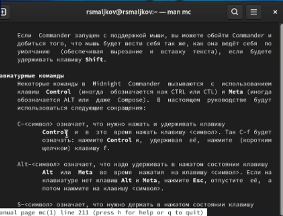
.

## Ход работы

2. Запускаем mc командой ```mc``` видим следующее:

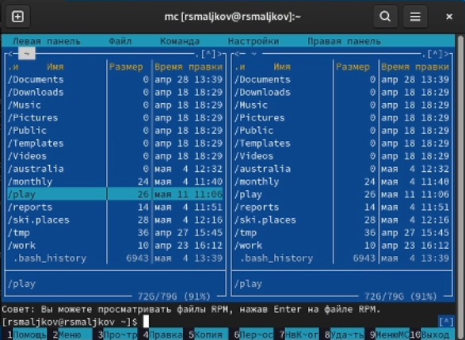
.

## Ход работы

3. Выполняем несколько операций используя управляющие клавиши (операции
с панелями; выделение/отмена выделения файлов, копирование/перемещение файлов, получение информации о размере и правах доступа на файлы и/или каталоги
и т.п.). 

## Ход работы

Для выделения используем зажатую клавишу SHIFT в комбинации с клавишами UPARROW и DOWNARROW. Копирование производится клавишей F5, перемещение клавишей F6. Размер файлов указан в стобце "Размер", доступ к изменению прав получаем посредством исопльзования комбинации клавиш CTRL+X C:

## Ход работы


.

## Ход работы

4. Выполняем основные команды левой панели, получаем подробную информацию о файлах:

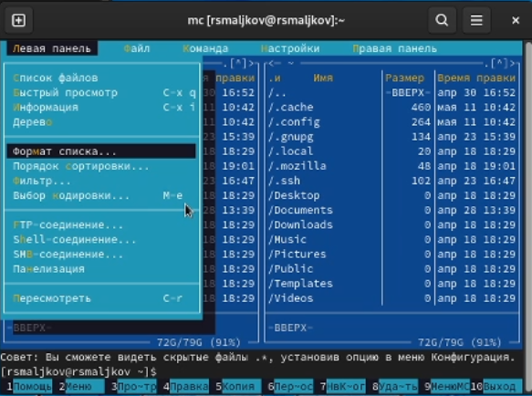
.

## Ход работы


.

## Ход работы

5. Используя возможности подменю Файл , выполняем:
– просмотр содержимого текстового файла;
– редактирование содержимого текстового файла (без сохранения результатов
редактирования);
– создание каталога;
– копирование в файлов в созданный каталог:

## Ход работы

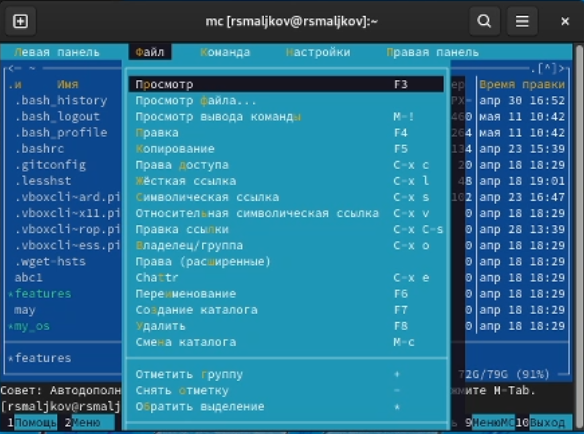
.

## Ход работы

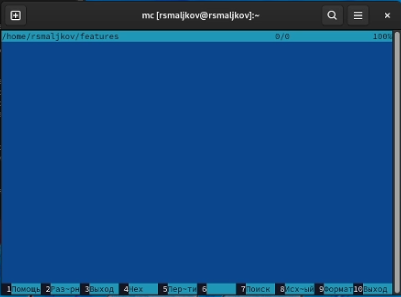
.

## Ход работы


.

## Ход работы


.

## Ход работы


.

## Ход работы

6. С помощью соответствующих средств подменю Команда осуществляем:
– поиск в файловой системе файла с заданными условиями (например, файла
с расширением .c или .cpp, содержащего строку main);
– выбор и повторение одной из предыдущих команд;
– переход в домашний каталог;
– анализ файла меню и файла расширений:

## Ход работы

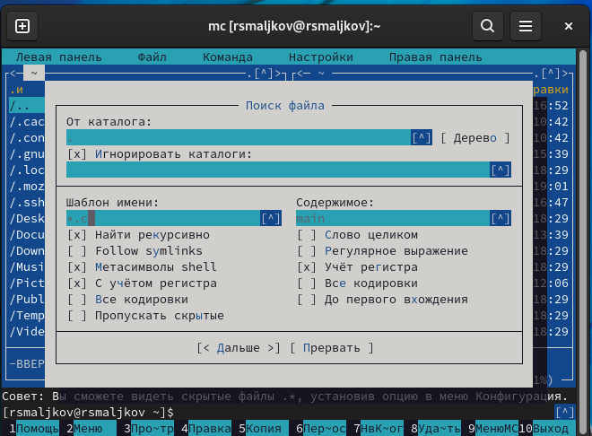
.

## Ход работы

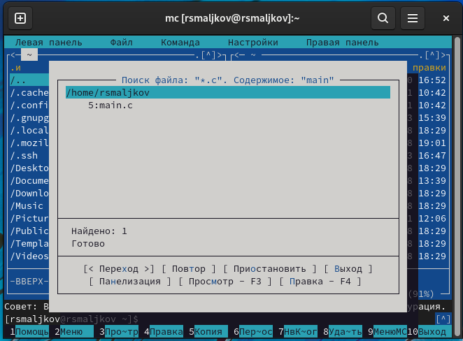
.

## Ход работы

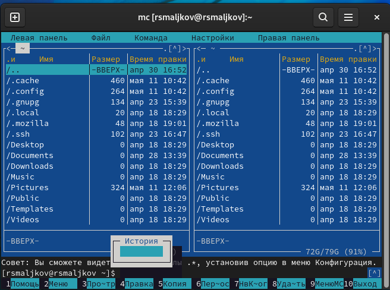
.

## Ход работы

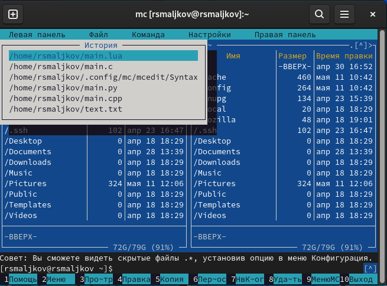
.

## Ход работы

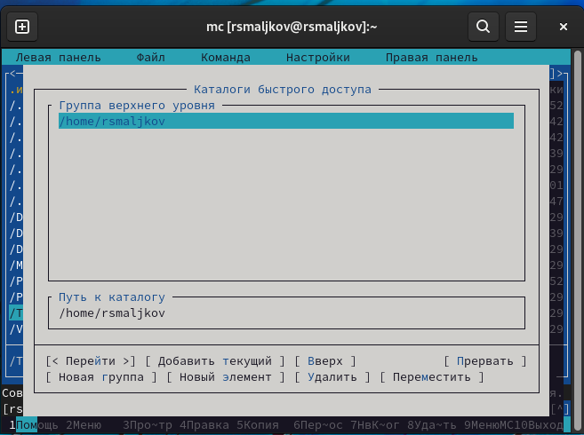
.

## Ход работы

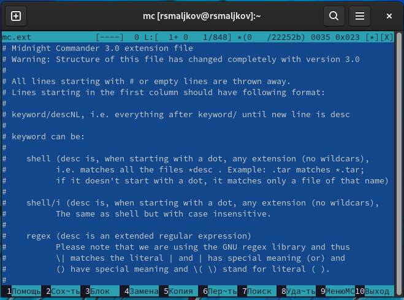
.

## Ход работы

7. Вызываем подменю настройки. Просматриваем операции:


.

## Ход работы

#### Задание по встроенному редактору mc
1. Создаем текстовый файл text.txt, для этого в консоль прописываем ```touch text.txt```( Скриншот 18 ).
2. Открываем этот файл с помощью встроенного в mc редактора ( клавиша F4 ).
3. Вставляем в открытый файл небольшой фрагмент текста, скопированный из любого
другого файла или Интернета ( Вставка происходит посредством применения комбинации клавиш SHIFT+Insert):

## Ход работы

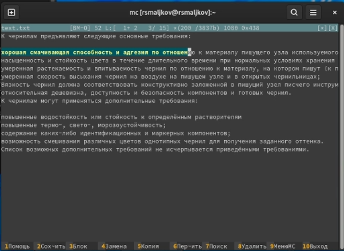
.

## Ход работы

4. Проделаем с текстом следующие манипуляции, используя горячие клавиши:
- 4.1. Удаляем строку текста ( Сочетание клавиш SHIFT DELETE ).
- 4.2. Выделяем фрагмент текста и копируем его на новую строку ( жмем F5 затем сочитание SHIFT INSERT ).
- 4.3. Выделяем фрагмент текста и переносим его на новую строку ( жмем F6 после выбора места для переноса ).
- 4.4. Сохраните файл (жмем F2).

## Ход работы

- 4.5. Отменяем последнее действие ( CTRL+U ).
- 4.6. Переходим в конец файла ( нажав комбинацию клавиш ) и пишем некоторый
текст ( CTRL+PageDown ).
- 4.7. Переходим в начало файла ( нажав комбинацию клавиш ) и пишем некоторый текст( CTRL+PageUp ).
- 4.8. Сохраняем и закрываем файл:

## Ход работы


.

## Ход работы


.

## Ход работы

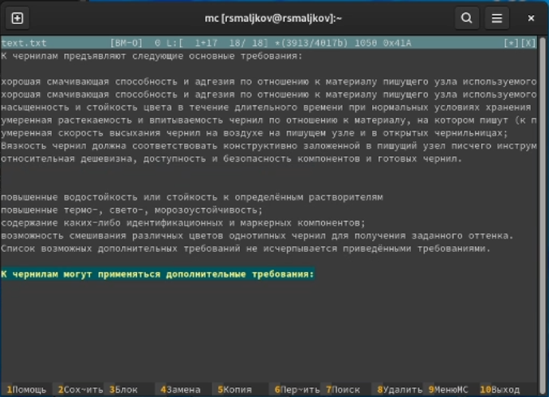
.

## Ход работы

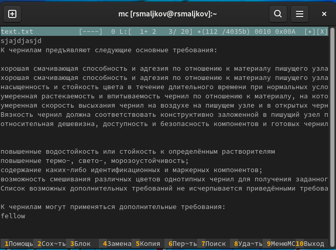
.

## Ход работы

5. Открываем файл с исходным текстом на некотором языке программирования (например C или Java).
6. Используя меню редактора, включаем подсветку синтаксиса ( Скриншоты 23 - 24 ):

## Ход работы


.

## Ход работы

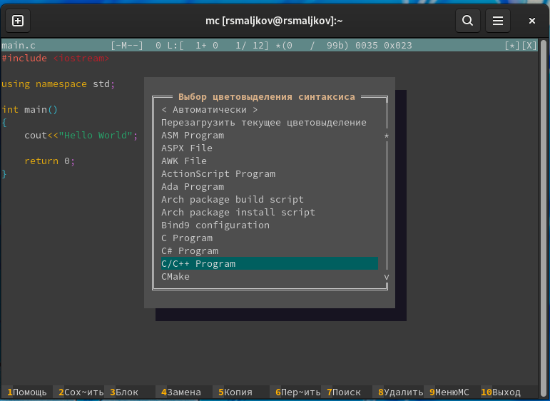
.


## Вывод

Были освоены основные возможности командной оболочки Midnight Commander. Были приобретены навыки практической работы по просмотру каталогов и файлов и навыки манипуляций с ними.