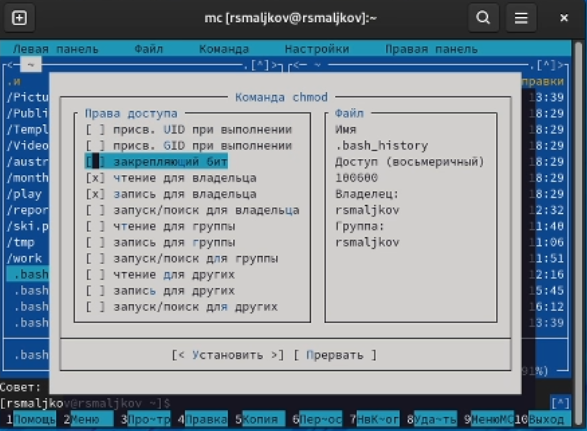
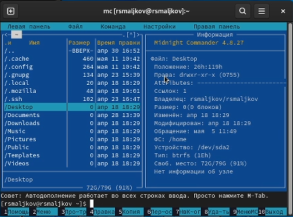
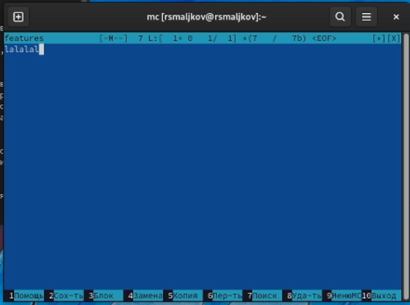
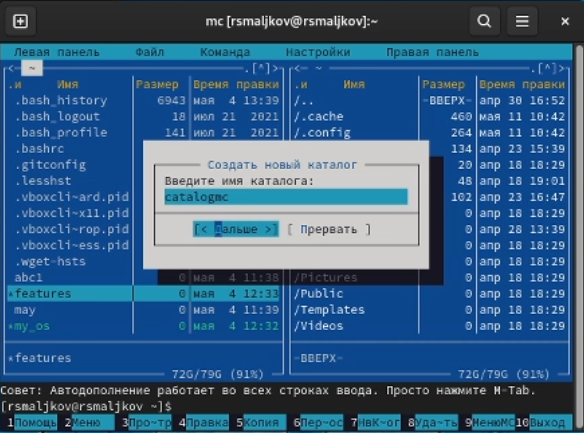
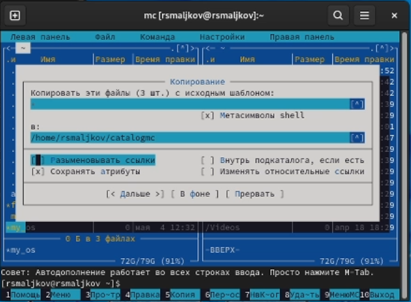
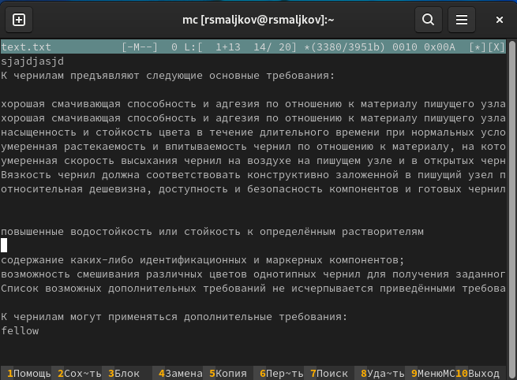

---
## Front matter
title: "Лабораторная работа №7"
subtitle: "Командная оболочка Midnight Commander"
author: "Мальков Роман"

## Generic otions
lang: ru-RU
toc-title: "Содержание"

## Bibliography
bibliography: bib/cite.bib
csl: pandoc/csl/gost-r-7-0-5-2008-numeric.csl

## Pdf output format
toc: true # Table of contents
toc-depth: 2

fontsize: 12pt
linestretch: 1.5
papersize: a4
documentclass: scrreprt
## I18n polyglossia
polyglossia-lang:
  name: russian
  options:
	- spelling=modern
	- babelshorthands=true
polyglossia-otherlangs:
  name: english
## I18n babel
babel-lang: russian
babel-otherlangs: english
## Fonts
mainfont: PT Serif
romanfont: PT Serif
sansfont: PT Sans
monofont: PT Mono
mainfontoptions: Ligatures=TeX
romanfontoptions: Ligatures=TeX
sansfontoptions: Ligatures=TeX,Scale=MatchLowercase
monofontoptions: Scale=MatchLowercase,Scale=0.9
## Biblatex
biblatex: true
biblio-style: "gost-numeric"
biblatexoptions:
  - parentracker=true
  - backend=biber
  - hyperref=auto
  - language=auto
  - autolang=other*
  - citestyle=gost-numeric
## Pandoc-crossref LaTeX customization
figureTitle: "Рис."
tableTitle: "Таблица"
listingTitle: "Листинг"
lofTitle: "Список иллюстраций"
lotTitle: "Список таблиц"
lolTitle: "Листинги"
## Misc options
indent: true
header-includes:
  - \usepackage{indentfirst}
  - \usepackage{float} # keep figures where there are in the text
  - \floatplacement{figure}{H} # keep figures where there are in the text
---
# Цель работы

Освоение основных возможностей командной оболочки Midnight Commander. Приобретение навыков практической работы по просмотру каталогов и файлов; манипуляций с ними.


# Задание
#### Задание по mc
1. Изучите информацию о mc, вызвав в командной строке man mc.
2. Запустите из командной строки mc, изучите его структуру и меню. 
3. Выполните несколько операций в mc, используя управляющие клавиши (операции
с панелями; выделение/отмена выделения файлов, копирование/перемещение файлов, получение информации о размере и правах доступа на файлы и/или каталоги
и т.п.)
4. Выполните основные команды меню левой (или правой) панели. Оцените степень
подробности вывода информации о файлах.
5. Используя возможности подменю Файл , выполните:
– просмотр содержимого текстового файла;
– редактирование содержимого текстового файла (без сохранения результатов
редактирования);
– создание каталога;
– копирование в файлов в созданный каталог.
6. С помощью соответствующих средств подменю Команда осуществите:
– поиск в файловой системе файла с заданными условиями (например, файла
с расширением .c или .cpp, содержащего строку main);
– выбор и повторение одной из предыдущих команд;
– переход в домашний каталог;
– анализ файла меню и файла расширений.
7. Вызовите подменю Настройки . Освойте операции, определяющие структуру экрана mc(Full screen, Double Width, Show Hidden Files и т.д.)

#### Задание по встроенному редактору mc
1. Создайте текстовой файл text.txt.
2. Откройте этот файл с помощью встроенного в mc редактора.
3. Вставьте в открытый файл небольшой фрагмент текста, скопированный из любого
другого файла или Интернета.
4. Проделайте с текстом следующие манипуляции, используя горячие клавиши:
- 4.1. Удалите строку текста.
- 4.2. Выделите фрагмент текста и скопируйте его на новую строку.
- 4.3. Выделите фрагмент текста и перенесите его на новую строку.
- 4.4. Сохраните файл.
- 4.5. Отмените последнее действие.
- 4.6. Перейдите в конец файла (нажав комбинацию клавиш) и напишите некоторый
текст.
- 4.7. Перейдите в начало файла (нажав комбинацию клавиш) и напишите некоторый текст.
- 4.8. Сохраните и закройте файл.
5. Откройте файл с исходным текстом на некотором языке программирования (например C или Java)
6. Используя меню редактора, включите подсветку синтаксиса, если она не включена,
или выключите, если она включена. 

# Теоретическое введение
== Hotkeys ==

Ctrl and Shift mean the same keyboard keys, Meta is metakey, on PC it's Alt or single press of Esc key. 
Fn (Where N > 10) mean Shift-F(n-10), i.e. '''F19''' is '''Shift-F9'''.

||''F3''||View file.||

||''F4''||Edit file.||

||''F13''||View raw file without extension specific.||

||''F14''||Create new file.||

||''F19''||Activate last used menu element.||

||''F20''||Quiet exit, without confirmation.||

||''Insert''||Select 'current object'^1^||

||''+''||select a group of files. (regular expression can be used)||

||''\''||Unselect a group of files. This is the opposite of the Plus key. ||

||''Meta+Enter''||Insert 'current object'^1^ to command line.||

||''Meta+.''||Show/hidde hidden files and directories (that starts with '.').||

||''Meta+,''||Change panel split view mode to vertical/horizontal.||

||''Meta+a''[[BR]]''Ctrl+x,p''||Insert in command line path of active panel.||

||''Meta+c''||Displays change directory dialog for active panel.||

||''Meta+h''||Displays command history.||

||''Meta+i''||Make the current directory of the current panel also the current directory of the other panel. Put the other panel to the listing mode if needed. If the current panel is panelized, the other panel doesn't become panelized.||

||''Meta+n''[[BR]]''Meta+p''||Use these keys to browse through the command history. Meta-p takes you to the last entry, Meta-n takes you to the next one.||

||''Meta+o''||If the currently selected file is a directory, load that directory on the other panel and moves the selection to the next file.||

||''Meta+g''[[BR]]''Meta+r''[[BR]]''Meta+j''||Used to select the top/middle/bottom file in a panel repectively||

||''Meta+t''||Change panel view ('Full','Brief','Long')||
||''Meta+Shift+?''||Find file.||

||''Meta+Shift+A''[[BR]]''Ctrl+x,Ctrl+p''||Insert to command line inactive panel path.||

||''Meta+Shift+H''||Display directory history.||

||''Ctrl+\''||Display directory hotlist.||

||''Ctrl+l''||Repaint all information in midnight commander.||

||''Ctrl+o''||Show/hida panell.||

||''Ctrl+r''||Reread content of current directory.||

||''Ctrl+s''||Quick search.||

||''Ctrl+Space''||Show directory size.||

||''Ctrl+x,a''||Show active VFS list.||

||''Ctrl+x,c''||Chmod (Change file Mode) for file or directory.||

||''Ctrl+x,i''||Set the other panel display mode to information.||

||''Ctrl+x,j''||Show background jobs.||

||''Ctrl+x,l''||Create hardlink for active file or directory.||

||''Ctrl+x,o''||Chown (Change Owner) for file or directory.||

||''Ctrl+x,q''||Set the other panel display mode to quick view.||

||''Ctrl+x,s''||Create symlink for active file or directory.||

||''Ctrl+x,t''||Insert selected names to command line.||

||''Ctrl+x,Ctrl+s''||Edit symlink.||

# Ход работы
#### Задание по mc
1. Изучаем информацию об mc командой ```man mc```( Скриншот 1 ):


( Скриншот 1 )

2. Запускаем mc командой ```mc``` видим следующее ( Скриншот 2 ):


( Скриншот 2 )

3. Выполняем несколько операций используя управляющие клавиши (операции
с панелями; выделение/отмена выделения файлов, копирование/перемещение файлов, получение информации о размере и правах доступа на файлы и/или каталоги
и т.п.). Для выделения используем зажатую клавишу SHIFT в комбинации с клавишами UPARROW и DOWNARROW. Копирование производится клавишей F5, перемещение клавишей F6. Размер файлов указан в стобце "Размер", доступ к изменению прав получаем посредством исопльзования комбинации клавиш CTRL+X C ( Скриншот 3 ):


( Скриншот 3 )

4. Выполняем основные команды левой панели, получаем подробную информацию о файлах ( Скриншоты 4-5 ):


( Скриншот 4 )


( Скриншот 5 )

5. Используя возможности подменю Файл , выполняем:
– просмотр содержимого текстового файла;
– редактирование содержимого текстового файла (без сохранения результатов
редактирования);
– создание каталога;
– копирование в файлов в созданный каталог ( Скриншоты 6 - 10 ):


( Скриншот 6 )


( Скриншот 7 )


( Скриншот 8 )


( Скриншот 9 )


( Скриншот 10 )

6. С помощью соответствующих средств подменю Команда осуществите:
– поиск в файловой системе файла с заданными условиями (например, файла
с расширением .c или .cpp, содержащего строку main);
– выбор и повторение одной из предыдущих команд;
– переход в домашний каталог;
– анализ файла меню и файла расширений ( Скриншоты 11 - 16 ):


( Скриншот 11 )


( Скриншот 12 )


( Скриншот 13 )


( Скриншот 14 )


( Скриншот 15 )


( Скриншот 16 )

7. Вызываем подменю настройки. Прсоматриваем операции ( Скриншот 17 ):


(Скриншот 17 )

#### Задание по встроенному редактору mc
1. Создаем текстовой файл text.txt, для этого в консоль прописываем ```touch text.txt```( Скриншот 18 ).
2. Открываем этот файл с помощью встроенного в mc редактора ( клавиша F4 ).
3. Вставляем в открытый файл небольшой фрагмент текста, скопированный из любого
другого файла или Интернета ( Вставка происходит посредством применения комбинации клавиш SHIFT+Insert) ( Скриншот 18 ):


( Скриншот 18 )

4. Проделаем с текстом следующие манипуляции, используя горячие клавиши:
- 4.1. Удаляем строку текста ( Сочетание клавиш SHIFT DELETE ).
- 4.2. Выделите фрагмент текста и скопируйте его на новую строку ( жмем F5 затем сочитание SHIFT INSERT ).
- 4.3. Выделите фрагмент текста и перенесите его на новую строку ( жмем F6 после выбора места для переноса ).
- 4.4. Сохраните файл (жмем F2).
- 4.5. Отмените последнее действие ( CTRL+U ).
- 4.6. Перейдите в конец файла ( нажав комбинацию клавиш ) и напишите некоторый
текст ( CTRL+PageDown ).
- 4.7. Перейдите в начало файла ( нажав комбинацию клавиш ) и напишите некоторый текст( CTRL+PageUp ).
- 4.8. Сохраните и закройте файл ( Скриншоты 19 - 22 ):


( Скриншот 19 )


( Скриншот 21 )


( Скриншот 21 )


( Скриншот 22 )


5. Открываем файл с исходным текстом на некотором языке программирования (например C или Java).
6. Используя меню редактора, включаем подсветку синтаксиса ( Скриншоты 23 - 24 ):


( Скриншот 23 )


( Скриншот 24 )

# Выводы

Были освоены основные возможности командной оболочки Midnight Commander. Были приобретены навыки практической работы по просмотру каталогов и файлов и навыки манипуляций с ними.


