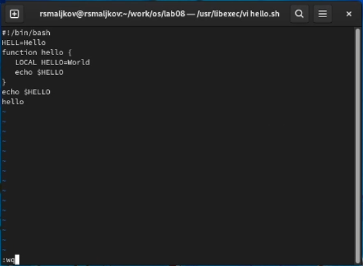
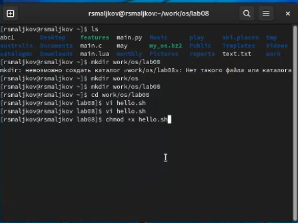
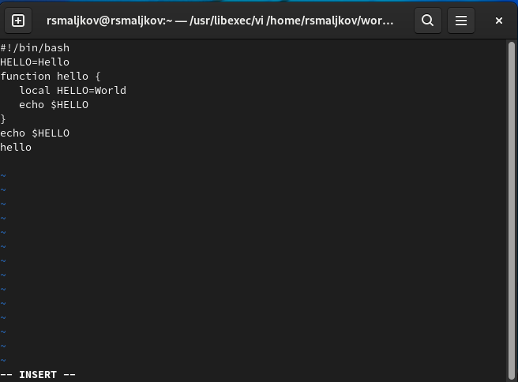
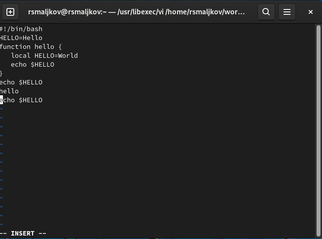
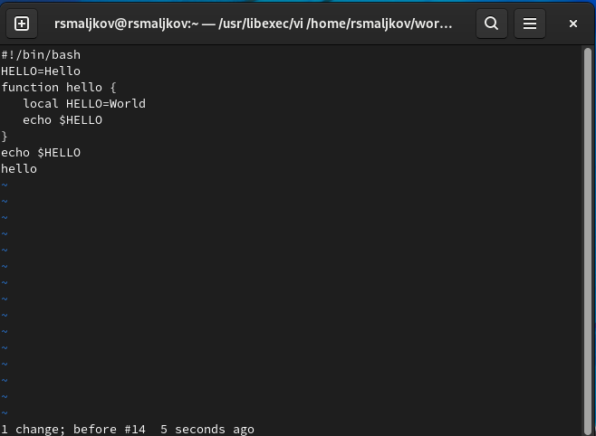

---
## Front matter
lang: ru-RU
title: Лабораторная работа №8
author: |
	Malkov Roman Sergeevich
date: 12.05.2022

## Formatting
toc: false
slide_level: 2
theme: metropolis
header-includes: 
 - \metroset{progressbar=frametitle,sectionpage=progressbar,numbering=fraction}
 - '\makeatletter'
 - '\beamer@ignorenonframefalse'
 - '\makeatother'
aspectratio: 44
section-titles: true
---


## Цель работы

Познакомиться с операционной системой Linux. Получить практические навыки работы с редактором vi, установленным по умолчанию практически во всех дистрибутивах.

## Ход работы

#### Задание 1. Создание нового файла с использованием vi
1. Создаем каталог с именем ~/work/os/lab06.
2. Переходим во вновь созданный каталог.
3. Вызываем vi и создаем файл hello.sh3. 

## Ход работы


## Ход работы

4. Нажимаем клавишу i и вводим следующий текст
```
#!/bin/bash
2 HELL=Hello
3 function hello {
4 LOCAL HELLO=World
5 echo $HELLO
6 }
7 echo $HELLO
8 hello

``` 
## Ход работы

5. Нажимаем клавишу Esc для перехода в командный режим после завершения ввода
текста.
6. Нажимаем : для перехода в режим последней строки, в нижней части нашего экрана появится приглашение в виде двоеточия.
7. Нажимаем w (записать) и q (выйти), а затем нажимаем клавишу Enter для сохранения
нашего текста и завершения работы.

## Ход работы



## Ход работы

8. Делаем файл исполняемым.



## Ход работы

#### Задание 2. Редактирование существующего файла
1. Вызываем vi на редактирование файла 


2. Устанавливаем курсор в конец слова HELL второй строки.

## Ход работы

3. Переходим в режим вставки ( клавиша a ) и заменяем HELL на HELLO. Нажмимаем Esc для возврата в командный режим.
4. Устанавливаем курсор на четвертую строку и стираем слово LOCAL (клавиша d + клавиша w).
5. Переходим в режим вставки и набираем следующий текст: local, нажимаем Esc для
возврата в командный режим.

## Ход работы



## Ход работы

6. Устанавливаем курсор на последней строке файла. Вставляем (Shift+Insert) после неё строку, содержащую следующий текст: echo $HELLO .



## Ход работы

7. Нажимаем Esc для перехода в командный режим.
8. Удаляем последнюю строку( клавиша d дважды).

## Ход работы



## Ход работы

9. Вводим команду отмены изменений u для отмены последней команды.
10. Вводим символ : для перехода в режим последней строки. Записываем произведённые
изменения и выходим из vi.11 . 

## Ход работы


## Вывод

Мы Познакомились с операционной системой Linux. Получили практические навыки работы с редактором vi, установленным по умолчанию практически во всех дистрибутивах.
