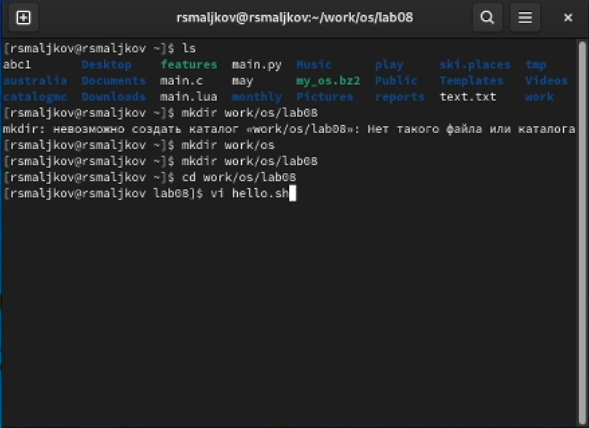
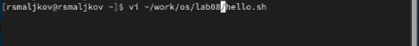
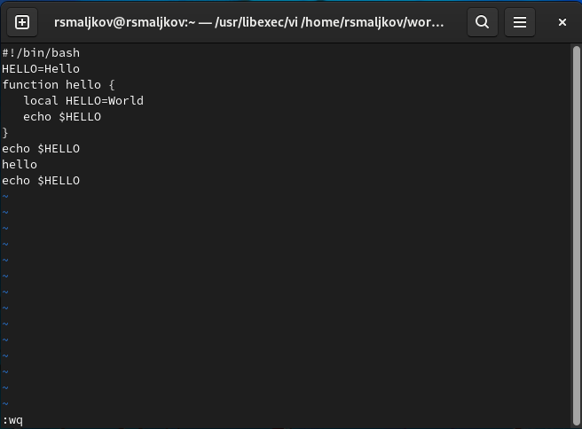

---
## Front matter
title: "Лабораторная работа №8"
subtitle: "Текстовой редактор vi"
author: "Мальков Роман"

## Generic otions
lang: ru-RU
toc-title: "Содержание"

## Bibliography
bibliography: bib/cite.bib
csl: pandoc/csl/gost-r-7-0-5-2008-numeric.csl

## Pdf output format
toc: true # Table of contents
toc-depth: 2

fontsize: 12pt
linestretch: 1.5
papersize: a4
documentclass: scrreprt
## I18n polyglossia
polyglossia-lang:
  name: russian
  options:
	- spelling=modern
	- babelshorthands=true
polyglossia-otherlangs:
  name: english
## I18n babel
babel-lang: russian
babel-otherlangs: english
## Fonts
mainfont: PT Serif
romanfont: PT Serif
sansfont: PT Sans
monofont: PT Mono
mainfontoptions: Ligatures=TeX
romanfontoptions: Ligatures=TeX
sansfontoptions: Ligatures=TeX,Scale=MatchLowercase
monofontoptions: Scale=MatchLowercase,Scale=0.9
## Biblatex
biblatex: true
biblio-style: "gost-numeric"
biblatexoptions:
  - parentracker=true
  - backend=biber
  - hyperref=auto
  - language=auto
  - autolang=other*
  - citestyle=gost-numeric
## Pandoc-crossref LaTeX customization
figureTitle: "Рис."
tableTitle: "Таблица"
listingTitle: "Листинг"
lofTitle: "Список иллюстраций"
lotTitle: "Список таблиц"
lolTitle: "Листинги"
## Misc options
indent: true
header-includes:
  - \usepackage{indentfirst}
  - \usepackage{float} # keep figures where there are in the text
  - \floatplacement{figure}{H} # keep figures where there are in the text
---
# Цель работы

Познакомиться с операционной системой Linux. Получить практические навыки работы с редактором vi, установленным по умолчанию практически во всех дистрибутивах.

# Задание
#### Задание 1. Создание нового файла с использованием vi
1. Создайте каталог с именем ~/work/os/lab06.
2. Перейдите во вновь созданный каталог.
3. Вызовите vi и создайте файл hello.sh3. 
4. Нажмите клавишу i и вводите следующий текст
```
#!/bin/bash
2 HELL=Hello
3 function hello {
4 LOCAL HELLO=World
5 echo $HELLO
6 }
7 echo $HELLO
8 hello

```
5. Нажмите клавишу Esc для перехода в командный режим после завершения ввода
текста.
6. Нажмите : для перехода в режим последней строки и внизу вашего экрана появится
приглашение в виде двоеточия.
7. Нажмите w (записать) и q (выйти), а затем нажмите клавишу Enter для сохранения
вашего текста и завершения работы.
8. Сделайте файл исполняемым.

#### Задание 2. Редактирование существующего файла
1. Вызовите vi на редактирование файла
2. Установите курсор в конец слова HELL второй строки.
3. Перейдите в режим вставки и замените на HELLO. Нажмите Esc для возврата в командный режим.
4. Установите курсор на четвертую строку и сотрите слово LOCAL.
5. Перейдите в режим вставки и наберите следующий текст: local, нажмите Esc для
возврата в командный режим.
6. Установите курсор на последней строке файла. Вставьте после неё строку, содержащую
следующий текст: echo $HELLO.
7. Нажмите Esc для перехода в командный режим.
8. Удалите последнюю строку.
9. Введите команду отмены изменений u для отмены последней команды.
10. Введите символ : для перехода в режим последней строки. Запишите произведённые
изменения и выйдите из vi.

# Ход работы

#### Задание 1. Создание нового файла с использованием vi
1. Создаем каталог с именем ~/work/os/lab06.
2. Переходим во вновь созданный каталог.
3. Вызываем vi и создаем файл hello.sh3 ( Скриншот 1 ). 


( Скриншот 1 )

4. Нажимаем клавишу i и вводим следующий текст
```
#!/bin/bash
2 HELL=Hello
3 function hello {
4 LOCAL HELLO=World
5 echo $HELLO
6 }
7 echo $HELLO
8 hello

``` 
5. Нажимаем клавишу Esc для перехода в командный режим после завершения ввода
текста.
6. Нажимаем : для перехода в режим последней строки, в нижней части нашего экрана появится приглашение в виде двоеточия.
7. Нажимаем w (записать) и q (выйти), а затем нажимаем клавишу Enter для сохранения
нашего текста и завершения работы  ( Скриншот 2 ).


( Скриншот 2 )

8. Делаем файл исполняемым ( Скриншот 3 ).


( Скриншот 3 )

#### Задание 2. Редактирование существующего файла
1. Вызываем vi на редактирование файла ( Скриншот 4 )


( Скриншот 4 )

2. Устанавливаем курсор в конец слова HELL второй строки.
3. Переходим в режим вставки ( клавиша a ) и заменяем HELL на HELLO. Нажмимаем Esc для возврата в командный режим.
4. Устанавливаем курсор на четвертую строку и стираем слово LOCAL (клавиша d + клавиша w).
5. Переходим в режим вставки и набираем следующий текст: local, нажимаем Esc для
возврата в командный режим. ( Скриншот 5 )


( Скриншот 5 )

6. Устанавливаем курсор на последней строке файла. Вставляем (Shift+Insert) после неё строку, содержащую следующий текст: echo $HELLO ( Скриншот 7 ).


( Скриншот 7 )

7. Нажимаем Esc для перехода в командный режим.
8. Удаляем последнюю строку( клавиша d дважды). ( Скриншот 8 )


( Скриншот 8 )

9. Вводим команду отмены изменений u для отмены последней команды.
10. Вводим символ : для перехода в режим последней строки. Записываем произведённые
изменения и выходим из vi.11 ( Скриншот 9 ). 


( Скриншот 9 )

# Выводы

Мы Познакомились с операционной системой Linux. Получили практические навыки работы с редактором vi, установленным по умолчанию практически во всех дистрибутивах.


