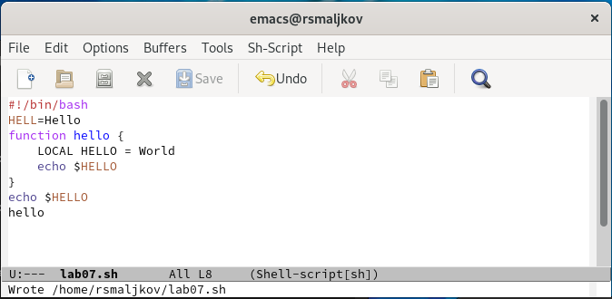
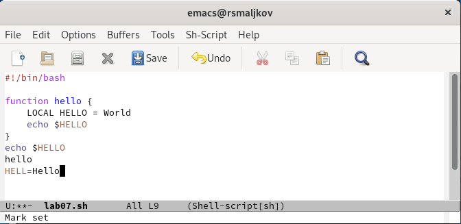
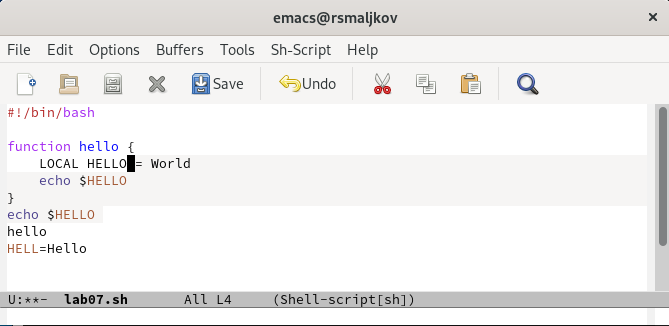
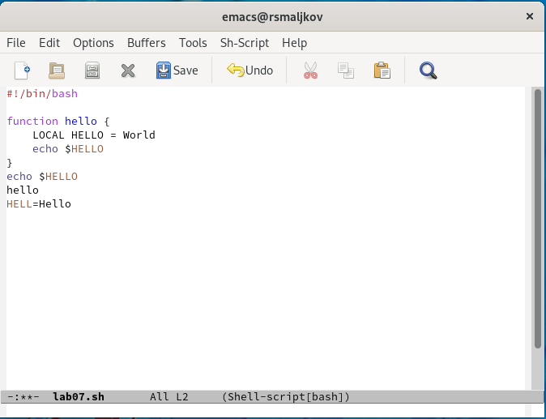
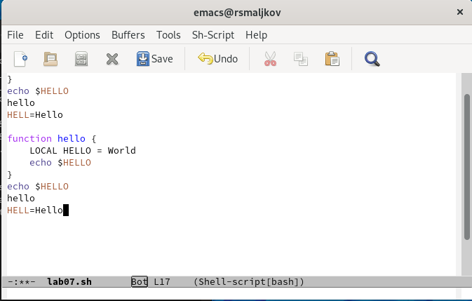
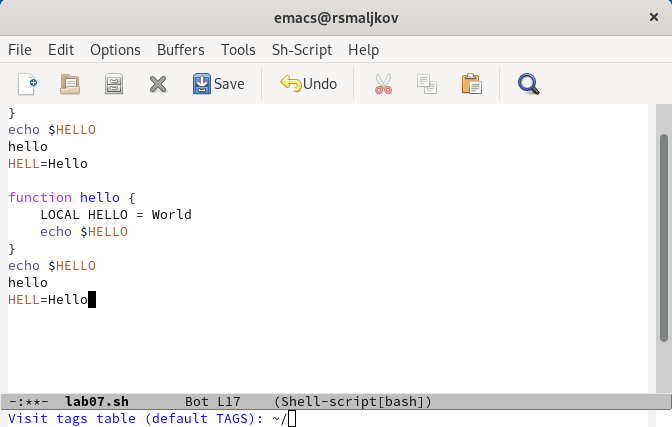
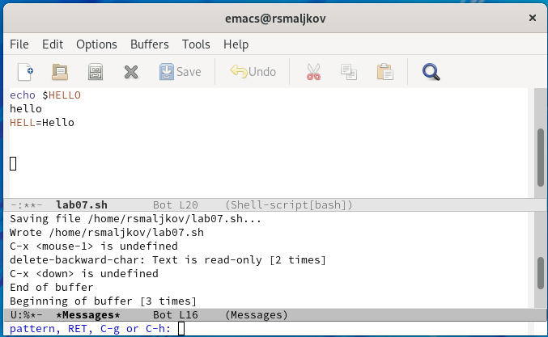
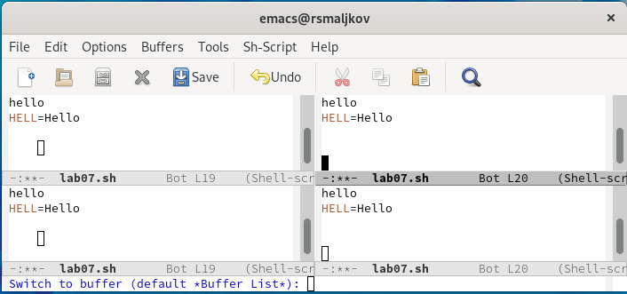
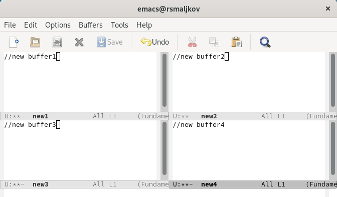
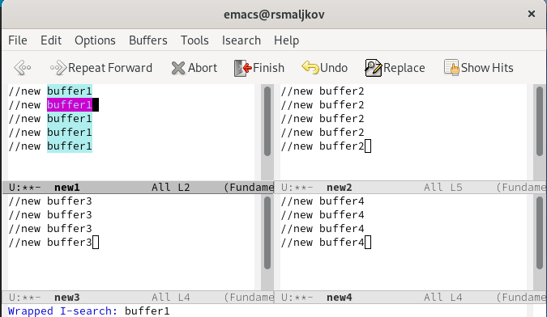

---
## Front matter
lang: ru-RU
title: Лабораторная работа №9
author: |
	Malkov Roman Sergeevich
date: 12.05.2022

## Formatting
toc: false
slide_level: 2
theme: metropolis
header-includes: 
 - \metroset{progressbar=frametitle,sectionpage=progressbar,numbering=fraction}
 - '\makeatletter'
 - '\beamer@ignorenonframefalse'
 - '\makeatother'
aspectratio: 44
section-titles: true
---


## Цель работы

Познакомиться с операционной системой Linux. Получить практические навыки работы с редактором Emacs.

## Ход работы

1. Открываем emacs командой ```emacs```. 


## Ход работы

2. Создаем файл lab07.sh с помощью комбинации Ctrl-x Ctrl-f (C-x C-f).


## Ход работы

3. Набираем текст:
```
#!/bin/bash
HELL=Hello
function hello {
LOCAL HELLO=World
echo $HELLO
}
echo $HELLO
hello

```

## Ход работы

4. Сохраняем файл с помощью комбинации Ctrl-x Ctrl-s (C-x C-s).



## Ход работы

5. Проделываем с текстом стандартные процедуры редактирования, каждое действие выполняем комбинацией клавиш.
- 5.1. Вырезаем одной командой целую строку (С-k).
- 5.2. Вставляем эту строку в конец файла (C-y).

## Ход работы



## Ход работы

- 5.3. Выделяем область текста (C-space).



## Ход работы

- 5.4. Копируем область в буфер обмена (M-w).
- 5.5. Вставляем область в конец файла.

## Ход работы


## Ход работы

- 5.6. Вновь выделяем эту область и на этот раз вырезаем её (C-w).



## Ход работы

- 5.7. Отменяем последнее действие (C-/).


## Ход работы

6. Учимся использовать команды по перемещению курсора.
- 6.1. Перемещаем курсор в начало строки (C-a).


## Ход работы

- 6.2. Перемещаем курсор в конец строки (C-e).



## Ход работы

- 6.3. Перемещаем курсор в начало буфера (M-<).


## Ход работы

- 6.4. Перемещаем курсор в конец буфера (M->).



## Ход работы

7. Управление буферами.
- 7.1. Выводим список активных буферов на экран (C-x C-b). 


## Ход работы

- 7.2. Перемещаемся во вновь открытое окно (C-x) o со списком открытых буферов
и переключаемся на другой буфер .



## Ход работы

- 7.3. Закрываем это окно (C-x 0).
- 7.4. Теперь вновь переключаемся между буферами, но уже без вывода их списка на
экран (C-x b).


## Ход работы

8. Управление окнами.
- 8.1. Делим фрейм на 4 части: Делим фрейм на два окна по вертикали (C-x 3),
а затем каждое из этих окон на две части по горизонтали (C-x 2).



## Ход работы

- 8.2. В каждом из четырёх созданных окон открываем новый буфер (файл) и вводим
несколько строк текста.



## Ход работы

9. Режим поиска
- 9.1. Переключаемся в режим поиска (C-s) и находим несколько слов, присутствующих
в тексте.
- 9.2. Переключаемся между результатами поиска, нажимая C-s.

## Ход работы



## Ход работы

- 9.3. Выходим из режима поиска, нажав C-g.
- 9.4. Переходим в режим поиска и замены (M-%), вводим текст, который следует найти
и заменить, нажимаем Enter , затем вводим текст для замены. После того как будут
подсвечены результаты поиска, нажимаем SPACE для подтверждения замены.

## Ход работы


## Ход работы


## Ход работы

- 9.5. Пробуем другой режим поиска, нажав M-s o. Отличие от предыдущего режима заключается в том что найденный результат записывается в буфер "Occur".


## Вывод

Научились работать с операционной системой Linux. Получили практические навыки работы с редактором Emacs.
