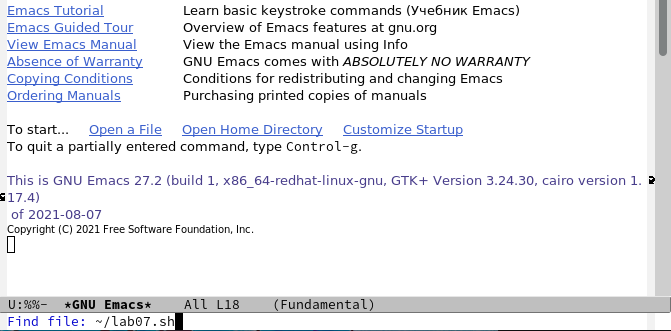
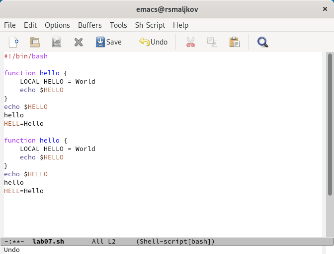
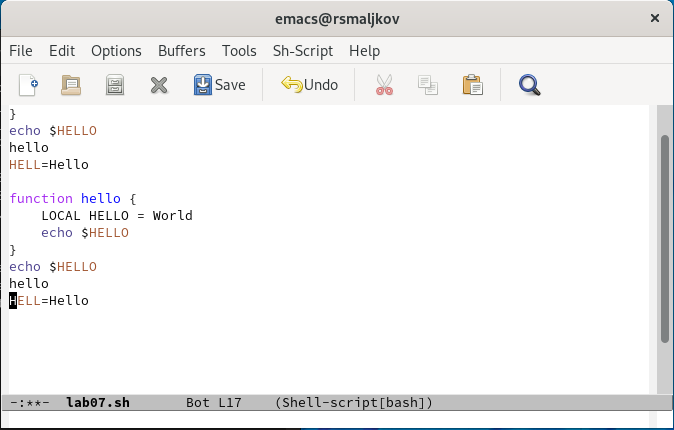
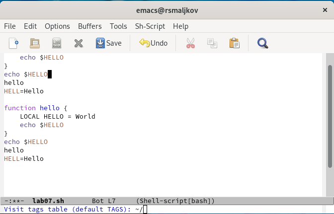
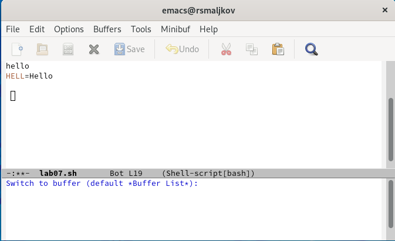
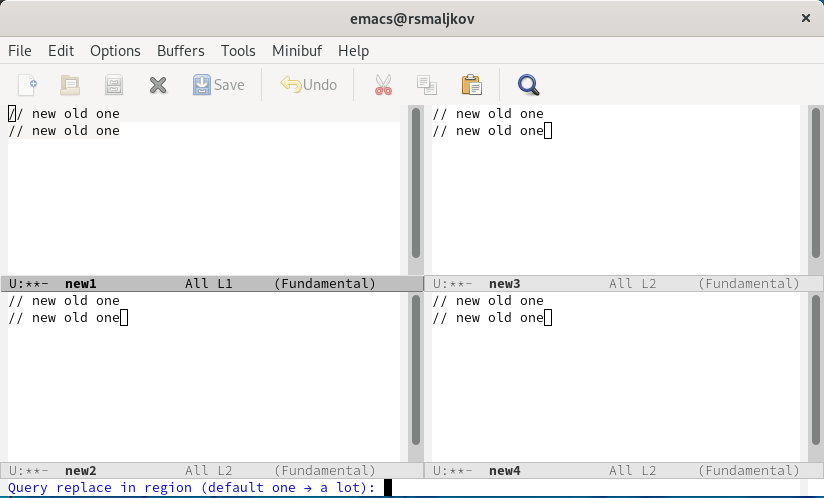
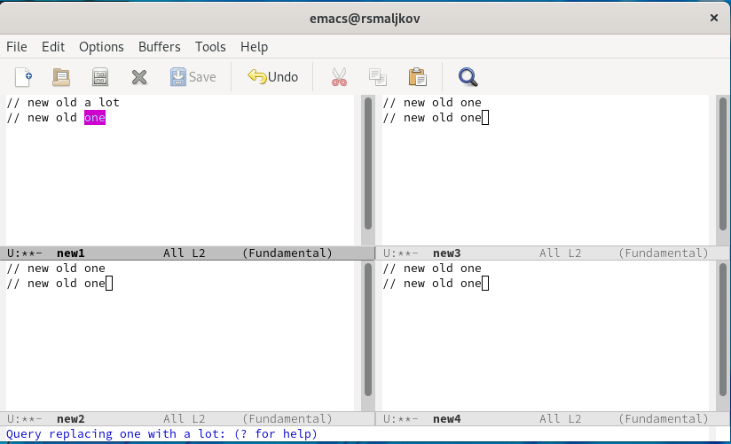
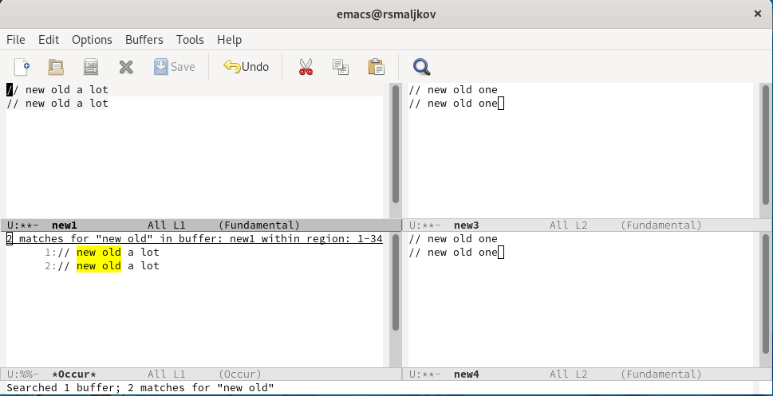

---
## Front matter
title: "Лабораторная работа №9"
subtitle: "Текстовой редактор emacs"
author: "Мальков Роман"

## Generic otions
lang: ru-RU
toc-title: "Содержание"

## Bibliography
bibliography: bib/cite.bib
csl: pandoc/csl/gost-r-7-0-5-2008-numeric.csl

## Pdf output format
toc: true # Table of contents
toc-depth: 2

fontsize: 12pt
linestretch: 1.5
papersize: a4
documentclass: scrreprt
## I18n polyglossia
polyglossia-lang:
  name: russian
  options:
	- spelling=modern
	- babelshorthands=true
polyglossia-otherlangs:
  name: english
## I18n babel
babel-lang: russian
babel-otherlangs: english
## Fonts
mainfont: PT Serif
romanfont: PT Serif
sansfont: PT Sans
monofont: PT Mono
mainfontoptions: Ligatures=TeX
romanfontoptions: Ligatures=TeX
sansfontoptions: Ligatures=TeX,Scale=MatchLowercase
monofontoptions: Scale=MatchLowercase,Scale=0.9
## Biblatex
biblatex: true
biblio-style: "gost-numeric"
biblatexoptions:
  - parentracker=true
  - backend=biber
  - hyperref=auto
  - language=auto
  - autolang=other*
  - citestyle=gost-numeric
## Pandoc-crossref LaTeX customization
figureTitle: "Рис."
tableTitle: "Таблица"
listingTitle: "Листинг"
lofTitle: "Список иллюстраций"
lotTitle: "Список таблиц"
lolTitle: "Листинги"
## Misc options
indent: true
header-includes:
  - \usepackage{indentfirst}
  - \usepackage{float} # keep figures where there are in the text
  - \floatplacement{figure}{H} # keep figures where there are in the text
---
# Цель работы

Познакомиться с операционной системой Linux. Получить практические навыки работы с редактором Emacs.

# Задание

1. Открыть emacs.
2. Создать файл lab07.sh с помощью комбинации Ctrl-x Ctrl-f (C-x C-f).
3. Наберите текст:
```
#!/bin/bash
HELL=Hello
function hello {
LOCAL HELLO=World
echo $HELLO
}
echo $HELLO
hello

```
4. Сохранить файл с помощью комбинации Ctrl-x Ctrl-s (C-x C-s).
5. Проделать с текстом стандартные процедуры редактирования, каждое действие должно осуществляться комбинацией клавиш.
- 5.1. Вырезать одной командой целую строку (С-k).
- 5.2. Вставить эту строку в конец файла (C-y).
- 5.3. Выделить область текста (C-space).
- 5.4. Скопировать область в буфер обмена (M-w).
- 5.5. Вставить область в конец файла.
- 5.6. Вновь выделить эту область и на этот раз вырезать её (C-w).
- 5.7. Отмените последнее действие (C-/).
6. Научитесь использовать команды по перемещению курсора.
- 6.1. Переместите курсор в начало строки (C-a).
- 6.2. Переместите курсор в конец строки (C-e).
- 6.3. Переместите курсор в начало буфера (M-<).
- 6.4. Переместите курсор в конец буфера (M->).
7. Управление буферами.
- 7.1. Вывести список активных буферов на экран (C-x C-b).8. 
- 7.2. Переместитесь во вновь открытое окно (C-x) o со списком открытых буферов
и переключитесь на другой буфер.
- 7.3. Закройте это окно (C-x 0).
- 7.4. Теперь вновь переключайтесь между буферами, но уже без вывода их списка на
экран (C-x b).
8. Управление окнами.
- 8.1. Поделите фрейм на 4 части: разделите фрейм на два окна по вертикали (C-x 3),
а затем каждое из этих окон на две части по горизонтали (C-x 2).
- 8.2. В каждом из четырёх созданных окон откройте новый буфер (файл) и введите
несколько строк текста.
9. Режим поиска
- 9.1. Переключитесь в режим поиска (C-s) и найдите несколько слов, присутствующих
в тексте.
- 9.2. Переключайтесь между результатами поиска, нажимая C-s.
- 9.3. Выйдите из режима поиска, нажав C-g.
- 9.4. Перейдите в режим поиска и замены (M-%), введите текст, который следует найти
и заменить, нажмите Enter , затем введите текст для замены. После того как будут
подсвечены результаты поиска, нажмите ! для подтверждения замены.
- 9.5. Испробуйте другой режим поиска, нажав M-s o. Объясните, чем он отличается от
обычного режима

# Ход работы

1. Открываем emacs командой ```emacs``` ( Скриншот 1 ). 


( Скриншот 1 )

2. Создаем файл lab07.sh с помощью комбинации Ctrl-x Ctrl-f (C-x C-f) ( Скриншот 2 ).


( Скриншот 2 )

3. Набираем текст:
```
#!/bin/bash
HELL=Hello
function hello {
LOCAL HELLO=World
echo $HELLO
}
echo $HELLO
hello

```
4. Сохраняем файл с помощью комбинации Ctrl-x Ctrl-s (C-x C-s) ( Скриншот 3 ).


( Скриншот 3 )

5. Проделываем с текстом стандартные процедуры редактирования, каждое действие выполняем комбинацией клавиш.
- 5.1. Вырезаем одной командой целую строку (С-k).
- 5.2. Вставляем эту строку в конец файла (C-y) ( Скриншот 4 ).


( Скриншот 4 )

- 5.3. Выделяем область текста (C-space)( Скриншот 5 ).


( Скриншот 5 )

- 5.4. Копируем область в буфер обмена (M-w).
- 5.5. Вставляем область в конец файла ( Скриншот 6 ).


( Скриншот 6 )

- 5.6. Вновь выделяем эту область и на этот раз вырезаем её (C-w) ( Скриншот 7 ).


( Скриншот 7 )

- 5.7. Отменяем последнее действие (C-/) ( Скриншот 8 ).


( Скриншот 8 )

6. Учимся использовать команды по перемещению курсора.
- 6.1. Перемещаем курсор в начало строки (C-a) ( Скриншот 9 ).


( Скриншот 9 )

- 6.2. Перемещаем курсор в конец строки (C-e) ( Скриншот 10 ).


( Скриншот 10)

- 6.3. Перемещаем курсор в начало буфера (M-<) ( Скриншот 11 ).


( Скриншот 11 )

- 6.4. Перемещаем курсор в конец буфера (M->) ( Скриншот 12 ).


( Скриншот 12 )

7. Управление буферами.
- 7.1. Выводим список активных буферов на экран (C-x C-b) ( Скриншот 13 ). 


( Скриншот 13 )

- 7.2. Перемещаемся во вновь открытое окно (C-x) o со списком открытых буферов
и переключаемся на другой буфер ( Скриншот 14 ).


( Скриншот 14 )

- 7.3. Закрываем это окно (C-x 0).
- 7.4. Теперь вновь переключаемся между буферами, но уже без вывода их списка на
экран (C-x b). ( Скриншот 15 )


( Скриншот 15 )

8. Управление окнами.
- 8.1. Делим фрейм на 4 части: Делим фрейм на два окна по вертикали (C-x 3),
а затем каждое из этих окон на две части по горизонтали (C-x 2) ( Скриншот 16 ).


( Скриншот 16 )

- 8.2. В каждом из четырёх созданных окон открываем новый буфер (файл) и вводим
несколько строк текста ( Скриншот 17 ).


( Скриншот 17 )

9. Режим поиска
- 9.1. Переключаемся в режим поиска (C-s) и находим несколько слов, присутствующих
в тексте.
- 9.2. Переключаемся между результатами поиска, нажимая C-s( Скриншот 18 ).


( Скриншот 18 )

- 9.3. Выходим из режима поиска, нажав C-g.
- 9.4. Переходим в режим поиска и замены (M-%), вводим текст, который следует найти
и заменить, нажимаем Enter , затем вводим текст для замены. После того как будут
подсвечены результаты поиска, нажимаем SPACE для подтверждения замены ( Скриншоты 19-20 ).


( Скриншот 19 )


( Скриншот 20 )

- 9.5. Пробуем другой режим поиска, нажав M-s o. Отличие от предыдущего режима заключается в том что найденный результат записывается в буфер "Occur" ( Скриншот 21 ).


( Скриншот 21 )


# Выводы

Vs gjpyfrjvbkbcm с операционной системой Linux. Получили практические навыки работы с редактором Emacs.


