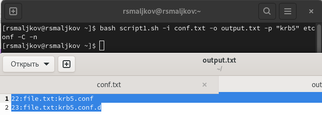
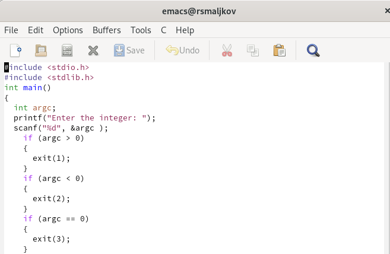
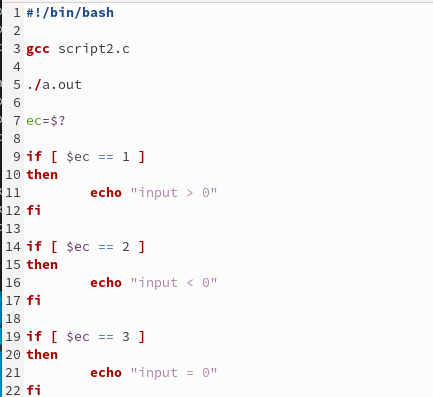
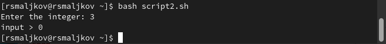
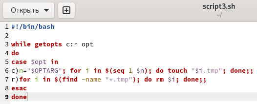
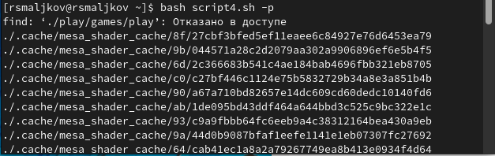

---
## Front matter
lang: ru-RU
title: Лабораторная работа номер 11
author: Malkov Roman Sergeevich
date: 25.05.2022

## Formatting
toc: false
slide_level: 2
theme: metropolis
header-includes: 
 - \metroset{progressbar=frametitle,sectionpage=progressbar,numbering=fraction}
 - '\makeatletter'
 - '\beamer@ignorenonframefalse'
 - '\makeatother'
aspectratio: 43
section-titles: true
---

## Цель работы

Изучить основы программирования в оболочке ОС UNIX. Научится писать более
сложные командные файлы с использованием логических управляющих конструкций
и циклов.

## Ход работы

Задание 1

( Скриншот 1 )

## Ход работы

( Скриншот 2 )

## Ход работы

Задание 2

( Скриншот 3 )

## Ход работы

( Скриншоты 4 )

## Ход работы

( Скриншоты 5 )

## Ход работы

Задание 3

( Скриншот 6 )

## Ход работы

( Скриншот 7 )

## Ход работы

( Скриншот 8 )

## Ход работы

Задание 4

( Скриншот 9 )

## Ход работы

( Скриншот 10 )

## Выводы

Мы изучили основы программирования в оболочке ОС UNIX. Научились писать более
сложные командные файлы с использованием логических управляющих конструкций
и циклов.

