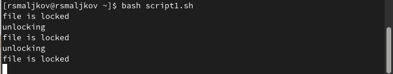
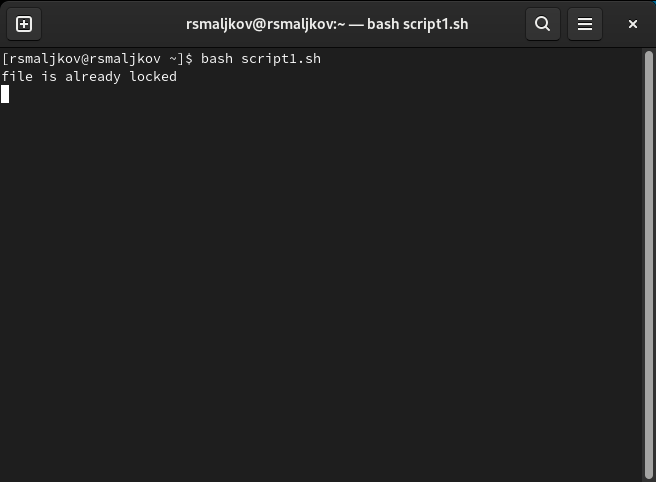
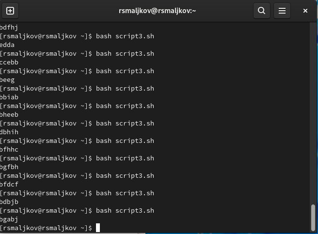

---
## Front matter
lang: ru-RU
title: Лабораторная работа номер 12
author: Malkov Roman Sergeevich
date: 26.05.2022

## Formatting
toc: false
slide_level: 2
theme: metropolis
header-includes: 
 - \metroset{progressbar=frametitle,sectionpage=progressbar,numbering=fraction}
 - '\makeatletter'
 - '\beamer@ignorenonframefalse'
 - '\makeatother'
aspectratio: 43
section-titles: true
---

## Цель работы

Изучить основы программирования в оболочке ОС UNIX. Научится писать более
сложные командные файлы с использованием логических управляющих конструкций
и циклов.

## Ход работы

1. Код и результаты вполнения смотреть в  скриншотах 1-3.

( Скриншот 1 )

## Ход работы

( Скриншот 2 )

## Ход работы

( Скриншот 3 )

## Ход работы

2. Код и результаты вполнения смотреть в  скриншотах 4-5.

( Скриншот 4 )

## Ход работы

( Скриншот 5 )

## Ход работы

3. Код и результаты вполнения смотреть в  скриншотах 6-7.
 

( Скриншот 6 )

## Ход работы

( Скриншот 7 )

## Выводы

Мы изучили основы программирования в оболочке ОС UNIX. Научились писать более
сложные командные файлы с использованием логических управляющих конструкций
и циклов.

