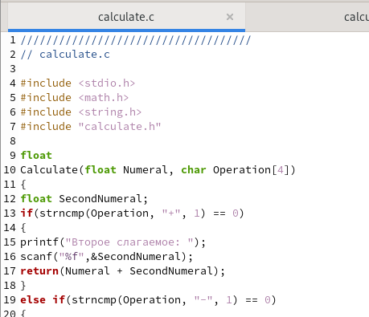
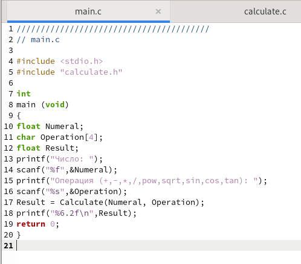
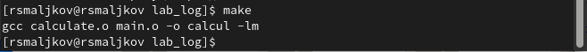
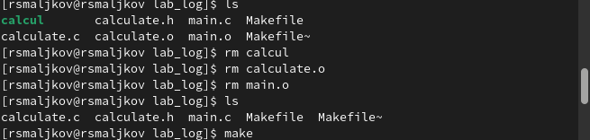
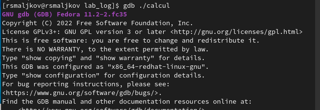
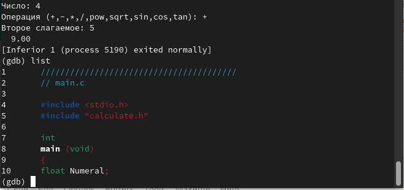
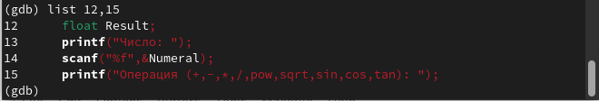
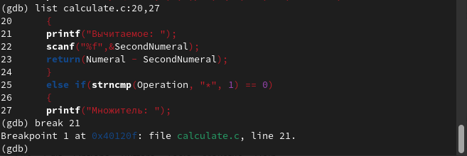
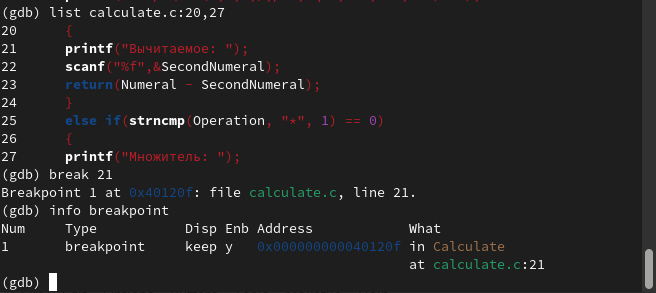
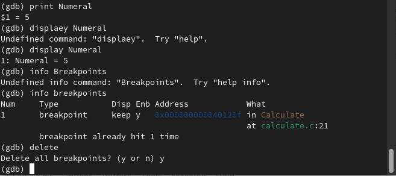

---
## Front matter
lang: ru-RU
title: Лабораторная работа номер 13
author: Malkov Roman Sergeevich
date: 01.06.2022

## Formatting
toc: false
slide_level: 2
theme: metropolis
header-includes: 
 - \metroset{progressbar=frametitle,sectionpage=progressbar,numbering=fraction}
 - '\makeatletter'
 - '\beamer@ignorenonframefalse'
 - '\makeatother'
aspectratio: 43
section-titles: true
---


## Цель работы

Приобрести простейшие навыки разработки, анализа, тестирования и отладки приложений в ОС типа UNIX/Linux на примере создания на языке программирования
С калькулятора с простейшими функциями.

## Ход работы

1. В домашнем каталоге создаем подкаталог ~/work/os/lab_prog ( Скриншот 1 ).


## Ход работы

2. Создаем в нём файлы: calculate.h, calculate.c, main.c ( Скриншоты 2 - 4 ).


## Ход работы



## Ход работы



## Ход работы

3. Выполняем компиляцию программы посредством использования gcc:


## Ход работы

4. При необходимости исправляем синтаксические ошибки.

5. Создаем Makefile ( Скриншоты 6 - 7 )


## Ход работы


## Ход работы

6. С помощью gdb выполняем отладку программы calcul( при этом стоит исправить файл Makefile, удалить все файлы формата .o и calcul файл, затем запустить Makefile ( Скриншоты 8 - 10 )):


## Ход работы





## Ход работы

– Запускаем отладчик GDB, загрузив в него программу для отладки ( Скриншот 11 ):
``` 
gdb ./calcul 
```



## Ход работы

– Для запуска программы внутри отладчика вводим команду run:
``` 
run 
```
## Ход работы

– Для постраничного (по 9 строк) просмотра исходного код используем команду
list ( Скриншот 12 ):
``` 
list 
```



## Ход работы

– Для просмотра строк с 12 по 15 основного файла используем list с параметрами ( Скриншот 13 ):
``` 
list 12,15 
```



## Ход работы

– Для просмотра определённых строк не основного файла используем list с параметрами:
``` 
list calculate.c:20,29 
```
– Устанавливаем точку останова в файле calculate.c на строке номер 21 ( Скриншот 14 ):
``` 
list calculate.c:20,27 
```
``` 
break 21 
```

## Ход работы



## Ход работы

– Выводим информацию об имеющихся в проекте точка останова ( Скриншот 15 ):
``` 
info breakpoints 
```



## Ход работы

– Запускаем программу внутри отладчика и убеждаемся, что программа остановится
в момент прохождения точки останова:
```
run
5
-
backtrace
```
– Отладчик выдаст следующую информацию ( Скриншот 16 ):
```
#0 Calculate (Numeral=5, Operation=0x7fffffffd280 "-")
at calculate.c:21
#1 0x0000000000400b2b in main () at main.c:17
```

## Ход работы


а команда backtrace покажет весь стек вызываемых функций от начала программы до текущего места.

## Ход работы

– Посмотрим, чему равно на этом этапе значение переменной Numeral, введя:
```
print Numeral
```

На экран должно быть выведено число 5.
– Сравниваем с результатом вывода на экран после использования команды:
```
display Numeral
```
– Убераем точки останова ( Скриншот 17 ):
```
info breakpoints
delete 1
```

## Ход работы



## Ход работы

7. С помощью утилиты splint попробуем проанализировать коды файлов calculate.c
и main.c. ( Скриншоты 18 - 19). 


## Ход работы


## Выводы

Мы приобрели простейшие навыки разработки, анализа, тестирования и отладки приложений в ОС типа UNIX/Linux на примере создания на языке программирования С калькулятора с простейшими функциями.
