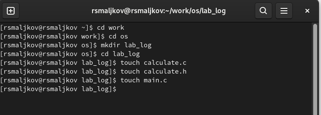
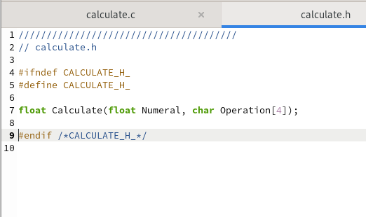
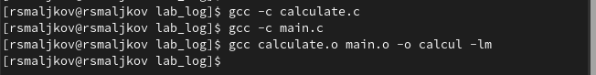
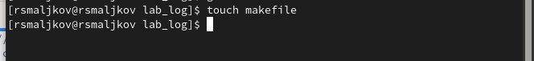
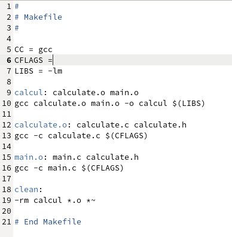
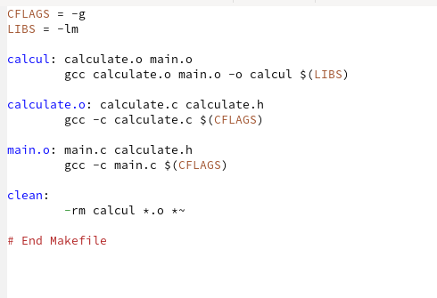
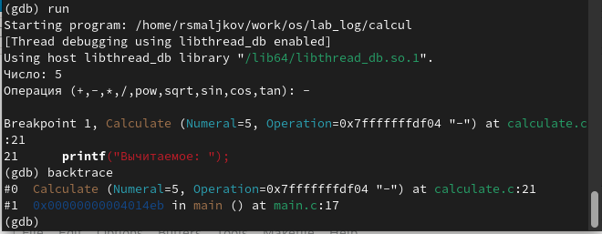
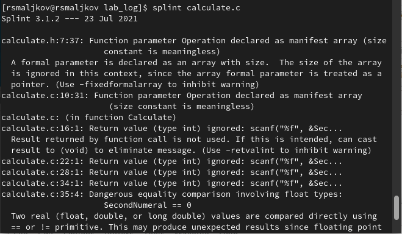
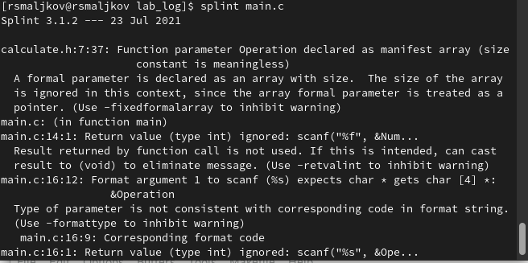

---
## Front matter
title: "Лабораторная работа номер 13"
subtitle: "Средства, применяемые при разработке программного обеспечения в ОС типа UNIX/Linux"
author: "Мальков Роман"

## Generic otions
lang: ru-RU
toc-title: "Содержание"

## Bibliography
bibliography: bib/cite.bib
csl: pandoc/csl/gost-r-7-0-5-2008-numeric.csl

## Pdf output format
toc: true # Table of contents
toc-depth: 2
fontsize: 12pt
linestretch: 1.5
papersize: a4
documentclass: scrreprt
## I18n polyglossia
polyglossia-lang:
  name: russian
  options:
	- spelling=modern
	- babelshorthands=true
polyglossia-otherlangs:
  name: english
## I18n babel
babel-lang: russian
babel-otherlangs: english
## Fonts
mainfont: PT Serif
romanfont: PT Serif
sansfont: PT Sans
monofont: PT Mono
mainfontoptions: Ligatures=TeX
romanfontoptions: Ligatures=TeX
sansfontoptions: Ligatures=TeX,Scale=MatchLowercase
monofontoptions: Scale=MatchLowercase,Scale=0.9
## Biblatex
biblatex: true
biblio-style: "gost-numeric"
biblatexoptions:
  - parentracker=true
  - backend=biber
  - hyperref=auto
  - language=auto
  - autolang=other*
  - citestyle=gost-numeric
## Pandoc-crossref LaTeX customization
figureTitle: "Рис."
tableTitle: "Таблица"
listingTitle: "Листинг"
lofTitle: "Список иллюстраций"
lotTitle: "Список таблиц"
lolTitle: "Листинги"
## Misc options
indent: true
header-includes:
  - \usepackage{indentfirst}
  - \usepackage{float} # keep figures where there are in the text
  - \floatplacement{figure}{H} # keep figures where there are in the text
---

# Цель работы

Приобрести простейшие навыки разработки, анализа, тестирования и отладки приложений в ОС типа UNIX/Linux на примере создания на языке программирования
С калькулятора с простейшими функциями.

# Задание

1. В домашнем каталоге создайте подкаталог ~/work/os/lab_prog.
2. Создайте в нём файлы: calculate.h, calculate.c, main.c.
Это будет примитивнейший калькулятор, способный складывать, вычитать, умножать
и делить, возводить число в степень, брать квадратный корень, вычислять sin, cos, tan.
При запуске он будет запрашивать первое число, операцию, второе число. После этого
программа выведет результат и остановится.
Реализация функций калькулятора в файле calculate.c:
```
1 ////////////////////////////////////
2 // calculate.c
3
4 #include <stdio.h>
5 #include <math.h>
6 #include <string.h>
7 #include "calculate.h"
8
9 float
10 Calculate(float Numeral, char Operation[4])
11 {
12 float SecondNumeral;
13 if(strncmp(Operation, "+", 1) == 0)
14 {
15 printf("Второе слагаемое: ");
16 scanf("%f",&SecondNumeral);
17 return(Numeral + SecondNumeral);
18 }
19 else if(strncmp(Operation, "-", 1) == 0)
20 {
21 printf("Вычитаемое: ");
22 scanf("%f",&SecondNumeral);
23 return(Numeral - SecondNumeral);
24 }
25 else if(strncmp(Operation, "*", 1) == 0)
26 {
27 printf("Множитель: ");
28 scanf("%f",&SecondNumeral);
29 return(Numeral * SecondNumeral);
30 }
31 else if(strncmp(Operation, "/", 1) == 0)
32 {
33 printf("Делитель: ");
34 scanf("%f",&SecondNumeral);
35 if(SecondNumeral == 0)
36 {
37 printf("Ошибка: деление на ноль! ");
38 return(HUGE_VAL);
39 }
40 else
41 return(Numeral / SecondNumeral);
42 }
43 else if(strncmp(Operation, "pow", 3) == 0)
44 {
45 printf("Степень: ");
46 scanf("%f",&SecondNumeral);
47 return(pow(Numeral, SecondNumeral));
48 }
49 else if(strncmp(Operation, "sqrt", 4) == 0)
50 return(sqrt(Numeral));
51 else if(strncmp(Operation, "sin", 3) == 0)
52 return(sin(Numeral));
53 else if(strncmp(Operation, "cos", 3) == 0)
54 return(cos(Numeral));
55 else if(strncmp(Operation, "tan", 3) == 0)
56 return(tan(Numeral));
57 else
58 {
59 printf("Неправильно введено действие ");
60 return(HUGE_VAL);
61 }
62 }
```
Интерфейсный файл calculate.h, описывающий формат вызова функциикалькулятора:
```
1 ///////////////////////////////////////
2 // calculate.h
3
4 #ifndef CALCULATE_H_
5 #define CALCULATE_H_
6
7 float Calculate(float Numeral, char Operation[4]);
8
9 #endif /*CALCULATE_H_*/
```

Основной файл main.c, реализующий интерфейс пользователя к калькулятору:
```
1 ////////////////////////////////////////
2 // main.c
3
4 #include <stdio.h>
5 #include "calculate.h"
6
7 int
8 main (void)
9 {
10 float Numeral;
11 char Operation[4];
12 float Result;
13 printf("Число: ");
14 scanf("%f",&Numeral);
15 printf("Операция (+,-,*,/,pow,sqrt,sin,cos,tan): ");
16 scanf("%s",&Operation);
17 Result = Calculate(Numeral, Operation);
18 printf("%6.2f\n",Result);
19 return 0;
20 }
```

3. Выполните компиляцию программы посредством gcc:
```
1 gcc -c calculate.c
2 gcc -c main.c
3 gcc calculate.o main.o -o calcul -lm
```
4. При необходимости исправьте синтаксические ошибки.

5. Создайте Makefile со следующим содержанием:
```
1 #
2 # Makefile
3 #
4
5 CC = gcc
6 CFLAGS =
7 LIBS = -lm
8
9 calcul: calculate.o main.o
10 gcc calculate.o main.o -o calcul $(LIBS)
11
12 calculate.o: calculate.c calculate.h
13 gcc -c calculate.c $(CFLAGS)
14
15 main.o: main.c calculate.h
16 gcc -c main.c $(CFLAGS)
17
18 clean:
19 -rm calcul *.o *~
20
21 # End Makefile
```
Поясните в отчёте его содержание.

6. С помощью gdb выполните отладку программы calcul (перед использованием gdb
исправьте Makefile):
– Запустите отладчик GDB, загрузив в него программу для отладки:
``` 
gdb ./calcul 
```
– Для запуска программы внутри отладчика введите команду run:
``` 
run 
```
– Для постраничного (по 9 строк) просмотра исходного код используйте команду
list:
``` 
list 
```
– Для просмотра строк с 12 по 15 основного файла используйте list с параметрами:
``` 
list 12,15 
```
– Для просмотра определённых строк не основного файла используйте list с параметрами:
``` 
list calculate.c:20,29 
```
– Установите точку останова в файле calculate.c на строке номер 21:
``` 
list calculate.c:20,27 
```
``` 
break 21 
```
– Выведите информацию об имеющихся в проекте точка останова:
``` 
info breakpoints 
```
– Запустите программу внутри отладчика и убедитесь, что программа остановится
в момент прохождения точки останова:
```
run
5
-
backtrace
```
– Отладчик выдаст следующую информацию:
```
#0 Calculate (Numeral=5, Operation=0x7fffffffd280 "-")
at calculate.c:21
#1 0x0000000000400b2b in main () at main.c:17
```
а команда backtrace покажет весь стек вызываемых функций от начала программы до текущего места.
– Посмотрите, чему равно на этом этапе значение переменной Numeral, введя:
```
print Numeral
```
На экран должно быть выведено число 5.
– Сравните с результатом вывода на экран после использования команды:
```
display Numeral
```
– Уберите точки останова:
```
info breakpoints
delete 1
```
7. С помощью утилиты splint попробуйте проанализировать коды файлов calculate.c
и main.c.8. 

# Ход работы

1. В домашнем каталоге создаем подкаталог ~/work/os/lab_prog ( Скриншот 1 ).




2. Создаем в нём файлы: calculate.h, calculate.c, main.c ( Скриншоты 2 - 4 ).




3. Выполняем компиляцию программы посредством использования gcc:




4. При необходимости исправляем синтаксические ошибки.

5. Создаем Makefile ( Скриншоты 6 - 7 )





Разберём этот файл, так в пятой строке мы видеи переменную CC которой присвоена bash команда gcc, однако эта перменная не используется, впрочем в ней и не было никакой нужды, далее в строке 6 видем перменную CFLAGS которой будет присвоенно значение -g, данная перменная используется в качестве флага в командах которые мы разберем ниже, LIBS также является флагом. В девятой строке calcul является целью, calculate.o и main.o — название файлов, который мы хотим скомпилировать; во второй строке, начиная с табуляции, задана команда компиляции gcc с опциями. Строки ниже устроены аналогично. Стоит отметить что в примере кода приведенного на скриншоте есть несколько критических ошибок которые мы исправим далее.


6. С помощью gdb выполняем отладку программы calcul( при этом стоит исправить файл Makefile, удалить все файлы формата .o и calcul файл, затем запустить Makefile ( Скриншоты 8 - 10 )):




– Запускаем отладчик GDB, загрузив в него программу для отладки ( Скриншот 11 ):
``` 
gdb ./calcul 
```


– Для запуска программы внутри отладчика вводим команду run:
``` 
run 
```
– Для постраничного (по 9 строк) просмотра исходного код используем команду
list ( Скриншот 12 ):
``` 
list 
```


– Для просмотра строк с 12 по 15 основного файла используем list с параметрами ( Скриншот 13 ):
``` 
list 12,15 
```


– Для просмотра определённых строк не основного файла используем list с параметрами:
``` 
list calculate.c:20,29 
```
– Устанавливаем точку останова в файле calculate.c на строке номер 21 ( Скриншот 14 ):
``` 
list calculate.c:20,27 
```
``` 
break 21 
```


– Выводим информацию об имеющихся в проекте точка останова ( Скриншот 15 ):
``` 
info breakpoints 
```


– Запускаем программу внутри отладчика и убеждаемся, что программа остановится
в момент прохождения точки останова:
```
run
5
-
backtrace
```
– Отладчик выдаст следующую информацию ( Скриншот 16 ):
```
#0 Calculate (Numeral=5, Operation=0x7fffffffd280 "-")
at calculate.c:21
#1 0x0000000000400b2b in main () at main.c:17
```




а команда backtrace покажет весь стек вызываемых функций от начала программы до текущего места.
– Посмотрим, чему равно на этом этапе значение переменной Numeral, введя:
```
print Numeral
```

На экран должно быть выведено число 5.
– Сравниваем с результатом вывода на экран после использования команды:
```
display Numeral
```
– Убераем точки останова ( Скриншот 17 ):
```
info breakpoints
delete 1
```


7. С помощью утилиты splint попробуем проанализировать коды файлов calculate.c
и main.c. ( Скриншоты 18 - 19). 






# Выводы

Мы приобрели простейшие навыки разработки, анализа, тестирования и отладки приложений в ОС типа UNIX/Linux на примере создания на языке программирования С калькулятора с простейшими функциями.

