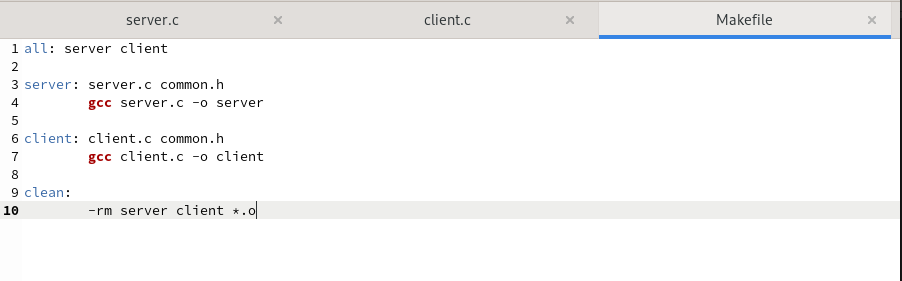
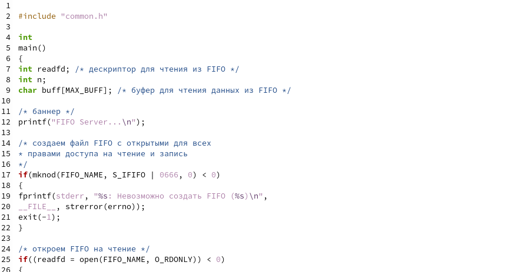

---
## Front matter
lang: ru-RU
title: Лабораторная работа номер 14
author: Malkov Roman Sergeevich
date: 02.06.2022

## Formatting
toc: false
slide_level: 2
theme: metropolis
header-includes: 
 - \metroset{progressbar=frametitle,sectionpage=progressbar,numbering=fraction}
 - '\makeatletter'
 - '\beamer@ignorenonframefalse'
 - '\makeatother'
aspectratio: 43
section-titles: true
---

## Цель работы

Приобретение практических навыков работы с именованными каналами.

## Ход работы

## Ход работы

## Ход работы

## Ход работы

## Ход работы

## Ход работы

## Выводы

Мы приобрели практические навыки работы с именованными каналами.
