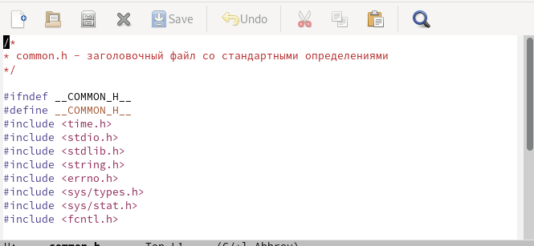
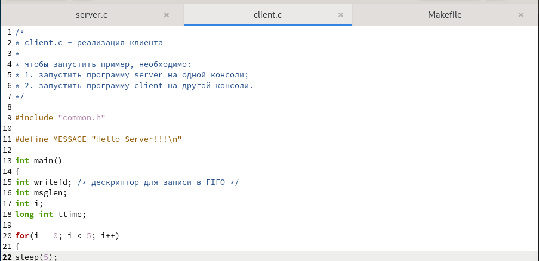
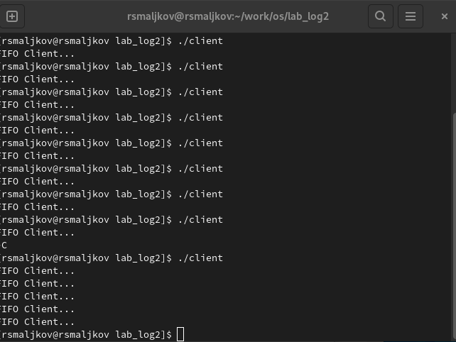

---
## Front matter
title: "Лабораторная работа номер 14"
subtitle: "Именованные каналы"
author: "Мальков Роман"

## Generic otions
lang: ru-RU
toc-title: "Содержание"

## Bibliography
bibliography: bib/cite.bib
csl: pandoc/csl/gost-r-7-0-5-2008-numeric.csl

## Pdf output format
toc: true # Table of contents
toc-depth: 2
fontsize: 12pt
linestretch: 1.5
papersize: a4
documentclass: scrreprt
## I18n polyglossia
polyglossia-lang:
  name: russian
  options:
	- spelling=modern
	- babelshorthands=true
polyglossia-otherlangs:
  name: english
## I18n babel
babel-lang: russian
babel-otherlangs: english
## Fonts
mainfont: PT Serif
romanfont: PT Serif
sansfont: PT Sans
monofont: PT Mono
mainfontoptions: Ligatures=TeX
romanfontoptions: Ligatures=TeX
sansfontoptions: Ligatures=TeX,Scale=MatchLowercase
monofontoptions: Scale=MatchLowercase,Scale=0.9
## Biblatex
biblatex: true
biblio-style: "gost-numeric"
biblatexoptions:
  - parentracker=true
  - backend=biber
  - hyperref=auto
  - language=auto
  - autolang=other*
  - citestyle=gost-numeric
## Pandoc-crossref LaTeX customization
figureTitle: "Рис."
tableTitle: "Таблица"
listingTitle: "Листинг"
lofTitle: "Список иллюстраций"
lotTitle: "Список таблиц"
lolTitle: "Листинги"
## Misc options
indent: true
header-includes:
  - \usepackage{indentfirst}
  - \usepackage{float} # keep figures where there are in the text
  - \floatplacement{figure}{H} # keep figures where there are in the text
---

# Цель работы

Приобретение практических навыков работы с именованными каналами.

# Задание

Изучите приведённые в тексте программы server.c и client.c. Взяв данные примеры
за образец, напишите аналогичные программы, внеся следующие изменения:
1. Работает не 1 клиент, а несколько (например, два).
2. Клиенты передают текущее время с некоторой периодичностью (например, раз в пять
секунд). Используйте функцию sleep() для приостановки работы клиента.
3. Сервер работает не бесконечно, а прекращает работу через некоторое время (например, 30 сек). Используйте функцию clock() для определения времени работы сервера.
Что будет в случае, если сервер завершит работу, не закрыв канал?


# Ход работы

Код и сркины приведены ниже ( Скриншоты 1 - 4 ):

1. Makefile
```
all: server client

server: server.c common.h
  gcc server.c -o server

client: client.c common.h
  gcc client.c -o client

clean:
  -rm server client *.o

```
2. common.h 
```
/*
* common.h - заголовочный файл со стандартными определениями
*/

#ifndef __COMMON_H__
#define __COMMON_H__
#include <time.h>
#include <stdio.h>
#include <stdlib.h>
#include <string.h>
#include <errno.h>
#include <sys/types.h>
#include <sys/stat.h>
#include <fcntl.h>

#define FIFO_NAME "/tmp/fifo"
#define MAX_BUFF 80

#endif /* __COMMON_H__ */
```
3. client.c
```
/*
* client.c - реализация клиента
*
* чтобы запустить пример, необходимо:
* 1. запустить программу server на одной консоли;
* 2. запустить программу client на другой консоли.
*/

#include "common.h"

#define MESSAGE "Hello Server!!!\n"

int main()
{
int writefd; /* дескриптор для записи в FIFO */
int msglen;
int i;
long int ttime;

for(i = 0; i < 5; i++)
{
sleep(5);
ttime = time(NULL);

/* баннер */
printf("FIFO Client...\n");

/* получим доступ к FIFO */
if((writefd = open(FIFO_NAME, O_WRONLY)) < 0)
{
fprintf(stderr, "%s: Невозможно открыть FIFO (%s)\n",__FILE__, strerror(errno));
exit(-1);
}

/* передадим сообщение серверу */
msglen = strlen(MESSAGE);
if(write(writefd, MESSAGE, msglen) != msglen)
{
fprintf(stderr, "%s: Ошибка записи в FIFO (%s)\n",__FILE__, strerror(errno));
exit(-2);
}

/* закроем доступ к FIFO */
close(writefd);
}
exit(0);
}

```
4. server.c
```
#include "common.h"

 int
 main()
 {
 int readfd; /* дескриптор для чтения из FIFO */
 int n;
 char buff[MAX_BUFF]; /* буфер для чтения данных из FIFO */

 /* баннер */
 printf("FIFO Server...\n");

 /* создаем файл FIFO с открытыми для всех
 * правами доступа на чтение и запись
 */
 if(mknod(FIFO_NAME, S_IFIFO | 0666, 0) < 0)
 {
 fprintf(stderr, "%s: Невозможно создать FIFO (%s)\n",
 __FILE__, strerror(errno));
 exit(-1);
 }

 /* откроем FIFO на чтение */
 if((readfd = open(FIFO_NAME, O_RDONLY)) < 0)
 {
 fprintf(stderr, "%s: Невозможно открыть FIFO (%s)\n",
 __FILE__, strerror(errno));
 exit(-2);
 }

clock_t cl = clock();
while (cl/CLOCKS_PER_SEC < 30)
{
 cl = clock();
 /* читаем данные из FIFO и выводим на экран */
  
 while((n = read(readfd, buff, MAX_BUFF)) > 0)
 {
 printf("sec = %d\n", cl/CLOCKS_PER_SEC);
 if(write(1, buff, n) != n)
 {
 fprintf(stderr, "%s: Ошибка вывода (%s)\n",
 __FILE__, strerror(errno));
 exit(-3);
 }
 }
}
 close(readfd); /* закроем FIFO */

 /* удалим FIFO из системы */
 
 if(unlink(FIFO_NAME) < 0)
 {
 fprintf(stderr, "%s: Невозможно удалить FIFO (%s)\n",
 __FILE__, strerror(errno));
 exit(-4);
 }

 exit(0);
 }

```







Пример выполнения программы ( Скриншоты 5 - 6)





# Выводы

Мы приобрели практические навыки работы с именованными каналами.
