---
## Front matter
lang: ru-RU
title: Проектная работа третий этап
author: |
	Malkov Roman Sergeevich
date: 07.05.2022

## Formatting
toc: false
slide_level: 2
theme: metropolis
header-includes: 
 - \metroset{progressbar=frametitle,sectionpage=progressbar,numbering=fraction}
 - '\makeatletter'
 - '\beamer@ignorenonframefalse'
 - '\makeatother'
aspectratio: 43
section-titles: true
---


## Цель работы

Выполнение третьего этапа проектной работы.

## Выполнение проектной работы
1. Запускаем локальный хост hugo командой ```hugo server```( Скриншот 1 ).


## Выполнение проектной работы

2. Изменяем наш список достижений, для этого переходим в директорию <папка с hugo>/content/home , после этого изменяем информацию в файлах: skills.md, experience.md, accomplishments.md ( Скриншоты 2 - 5 ).


## Выполнение проектной работы

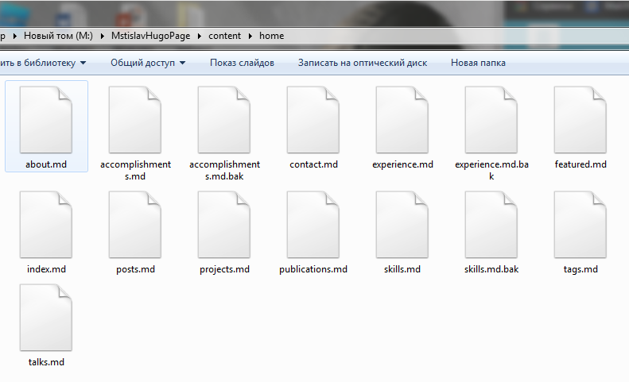


## Выполнение проектной работы

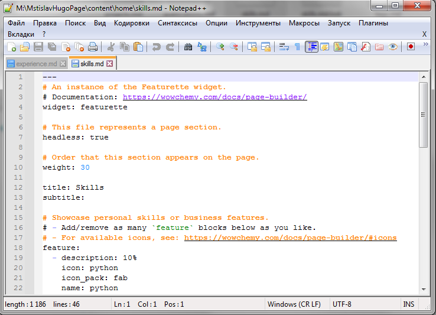


## Выполнение проектной работы

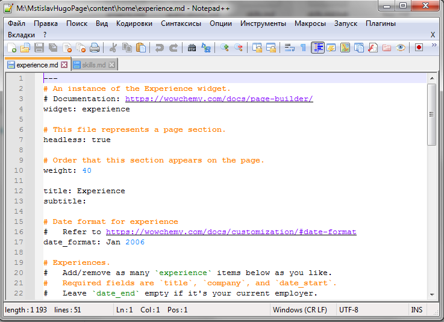


## Выполнение проектной работы

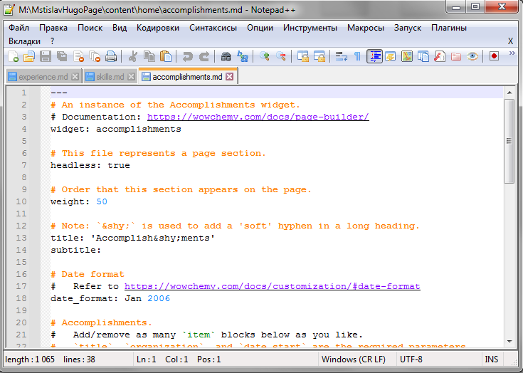


## Выполнение проектной работы

3. Добавляем пост по прошедшей неделе а также пост про markdown. Для этого прописываем команду ``` hugo new <папка>/<файл>.md ```. Далее перекидываем наши папки со статьями в папку post. Редактируем содержимое файлов .md ( Скриншоты 6 - 8 ).


## Выполнение проектной работы


## Выполнение проектной работы

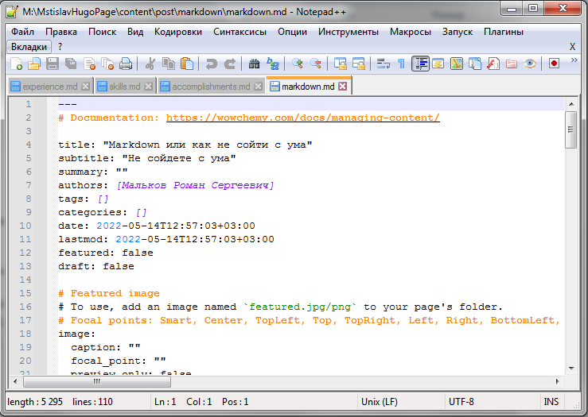


## Выполнение проектной работы


## Выполнение проектной работы

4. Прописываем команду hugo -D, она обновит нашу диреуторию public. Затем содержимое public , как и в первой части выполнения работы, переносим в директорию сайта github.io. После данных мероприятий выгружаем все изменения в github ( Скриншоты 9-11 ).

## Выполнение проектной работы

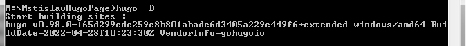

## Выполнение проектной работы

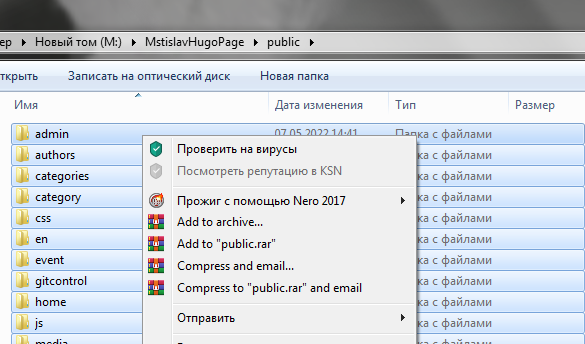

## Выполнение проектной работы

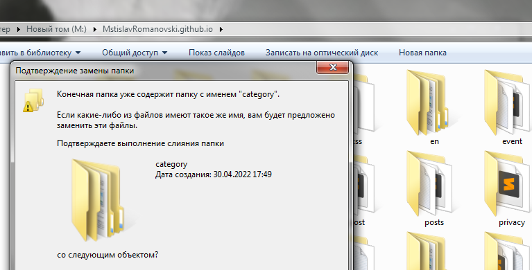

## Выполнение проектной работы

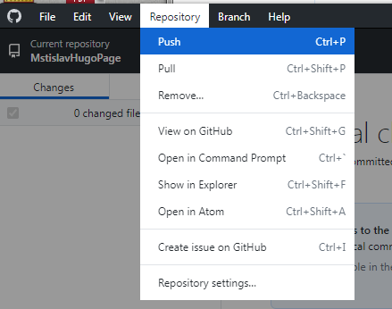

## Выполнение проектной работы

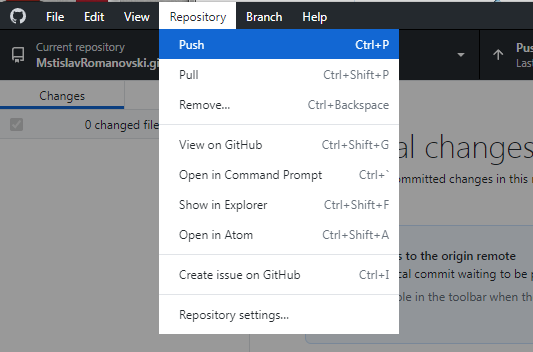

## Выполнение проектной работы

И вот результат на скриншотах 13 - 14:


## Выполнение проектной работы

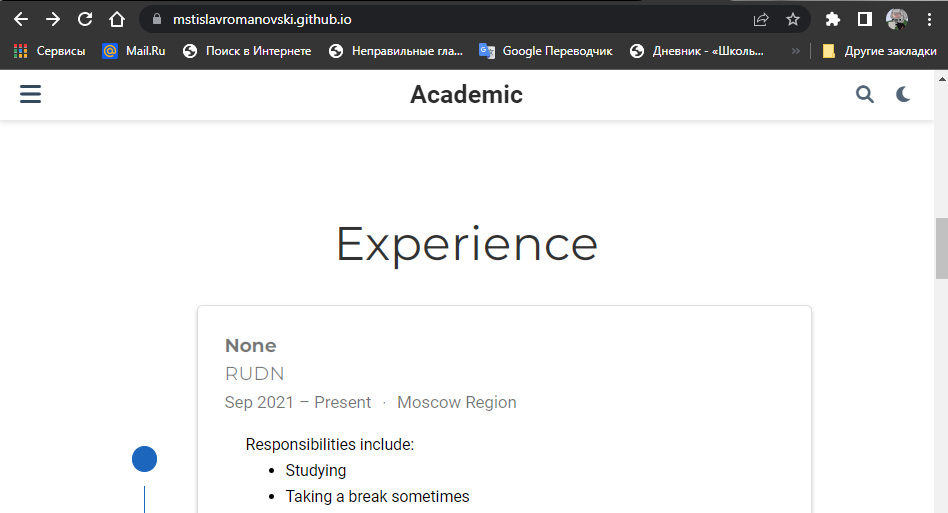

## Вывод

Второй этап проеткной работы выполнен.
