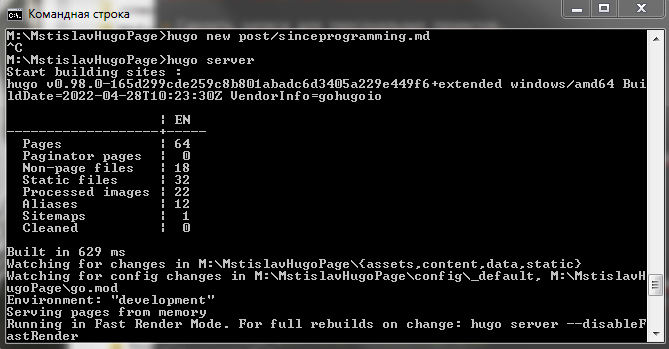
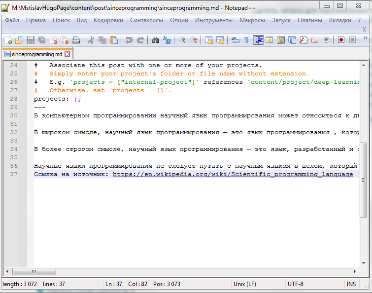
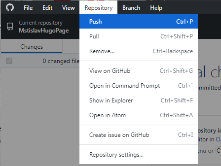
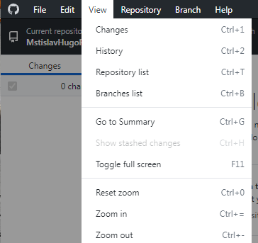
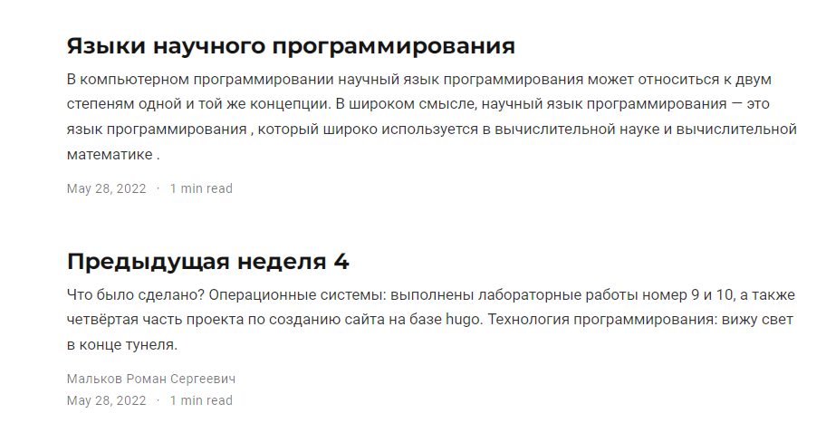
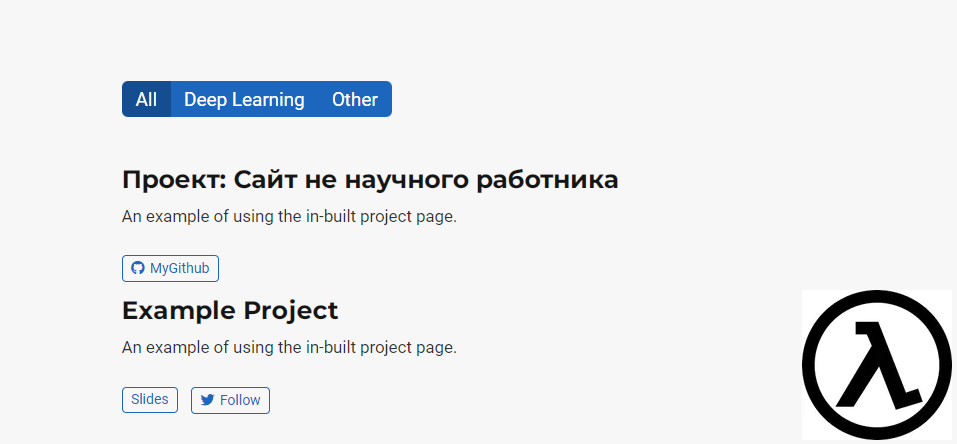

---
## Front matter
lang: ru-RU
title: Проектная работа пятый этап
author: |
	Malkov Roman Sergeevich
date: 07.05.2022

## Formatting
toc: false
slide_level: 2
theme: metropolis
header-includes: 
 - \metroset{progressbar=frametitle,sectionpage=progressbar,numbering=fraction}
 - '\makeatletter'
 - '\beamer@ignorenonframefalse'
 - '\makeatother'
aspectratio: 43
section-titles: true
---


## Цель работы
Выполнение пятого этапа проектной работы.

## Выполнение проектной работы

1. Запускаем локальный хост hugo командой ```hugo server```( Скриншот 1 ).


( Скриншот 1 )

## Выполнение проектной работы

2. Создаем запись для персонального проекта. Для этого прописываем команду ``` hugo new project/<папка>/<файл>.md ```. Редактируем ( Скриншот 2 ).

## Выполнение проектной работы


( Скриншот 2 )

## Выполнение проектной работы

3. Добавляем пост по прошедшей неделе а также пост про научные языки программирования. Для этого прописываем команду ``` hugo new post/<папка>/<файл>.md ```. Редактируем содержимое файлов .md ( Скриншоты 3 - 4 ).

## Выполнение проектной работы


( Скриншот 3 )

## Выполнение проектной работы


( Скриншот 4 )

## Выполнение проектной работы

4. Прописываем команду hugo -D, она обновит нашу диреуторию public. Затем содержимое public , как и в предыдущей части выполнения работы, переносим в директорию сайта github.io. После данных мероприятий выгружаем все изменения в github ( Скриншоты 5-9 ).

## Выполнение проектной работы


( Скриншот 5 )

## Выполнение проектной работы


( Скриншот 6 )

## Выполнение проектной работы


( Скриншот 7 )

## Выполнение проектной работы


( Скриншот 8 )

## Выполнение проектной работы


( Скриншот 9 )

## Выполнение проектной работы

И вот результат на скриншотах 10 - 11:


( Скриншот 10 )

## Выполнение проектной работы


( Скриншот 11 )


## Вывод

Пятый этап проеткной работы выполнен.