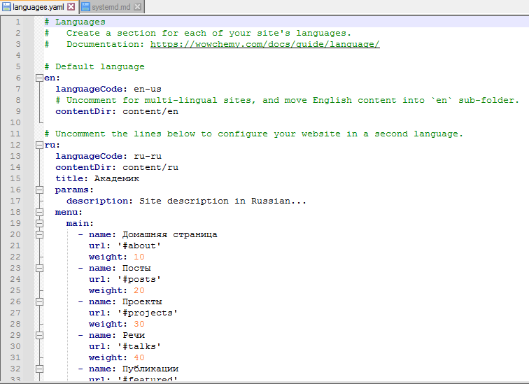
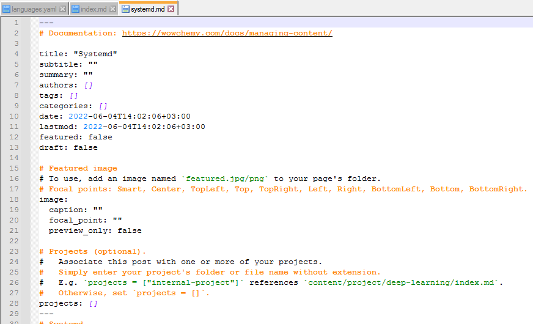

---
## Front matter
title: "Проектная работа"
subtitle: "шестой этап"
author: "Мальков Роман Сергеевич"

## Generic otions
lang: ru-RU
toc-title: "Содержание"

## Bibliography
bibliography: bib/cite.bib
csl: pandoc/csl/gost-r-7-0-5-2008-numeric.csl

## Pdf output format
toc: true # Table of contents
toc-depth: 2
fontsize: 12pt
linestretch: 1.5
papersize: a4
documentclass: scrreprt
## I18n polyglossia
polyglossia-lang:
  name: russian
  options:
	- spelling=modern
	- babelshorthands=true
polyglossia-otherlangs:
  name: english
## I18n babel
babel-lang: russian
babel-otherlangs: english
## Fonts
mainfont: PT Serif
romanfont: PT Serif
sansfont: PT Sans
monofont: PT Mono
mainfontoptions: Ligatures=TeX
romanfontoptions: Ligatures=TeX
sansfontoptions: Ligatures=TeX,Scale=MatchLowercase
monofontoptions: Scale=MatchLowercase,Scale=0.9
## Biblatex
biblatex: true
biblio-style: "gost-numeric"
biblatexoptions:
  - parentracker=true
  - backend=biber
  - hyperref=auto
  - language=auto
  - autolang=other*
  - citestyle=gost-numeric
## Pandoc-crossref LaTeX customization
figureTitle: "Рис."
tableTitle: "Таблица"
listingTitle: "Листинг"
lofTitle: "Список иллюстраций"
lotTitle: "Список таблиц"
lolTitle: "Листинги"
## Misc options
indent: true
header-includes:
  - \usepackage{indentfirst}
  - \usepackage{float} # keep figures where there are in the text
  - \floatplacement{figure}{H} # keep figures where there are in the text
---

# Цель работы

Выполнение четвертого этапа проектной работы.

# Задание

Размещение двуязычного сайта на Github.

- Сделать поддержку английского и русского языков.
- Разместить элементы сайта на обоих языках.
- Разместить контент на обоих языках.
- Сделать пост по прошедшей неделе.
- Добавить пост на тему по выбору (на двух языках).

# Выполнение проектной работы

1. Запускаем локальный хост hugo командой ```hugo server```.

2. Заходи в директорию сайта переходим в config а затем в _default. Редактируем файл languages.yaml (Скриншот 1).



3. Создаем в директории content две папки "en" и "ru". В них помещаем содержимое контента ( Скриншот 2 ).


2. Создаем запись для персонального проекта. Для этого прописываем команду ``` hugo new project/<папка>/<файл>.md ```. Редактируем.
3. Добавляем пост по прошедшей неделе а также пост про оформление отчёта. Для этого прописываем команду ``` hugo new post/<папка>/<файл>.md ```. Редактируем содержимое файлов .md ( Скриншоты 3 - 4 ).





4. Прописываем команду hugo -D, она обновит нашу диреуторию public. Затем содержимое public , как и в предыдущей части выполнения работы, переносим в директорию сайта github.io. После данных мероприятий выгружаем все изменения в github.

И вот результат на скриншоте 5:


# Выводы
Шестой этап проеткной работы выполнен.

